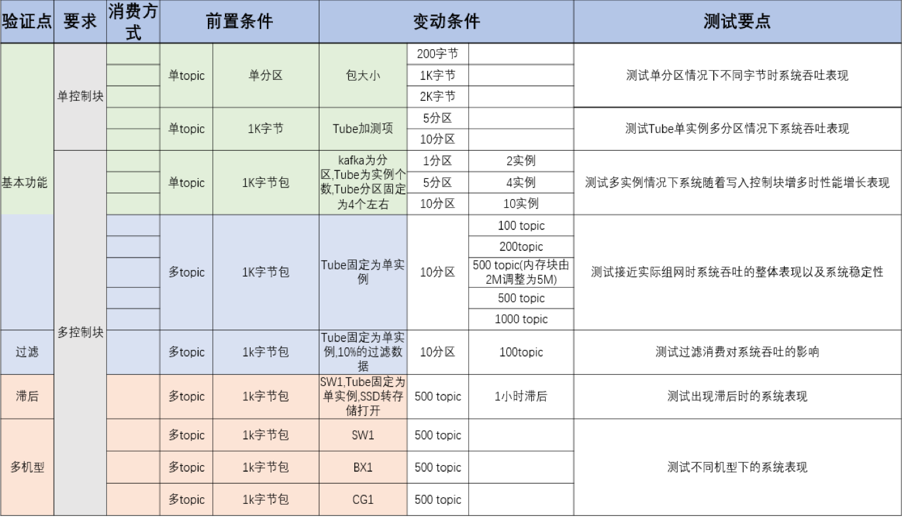
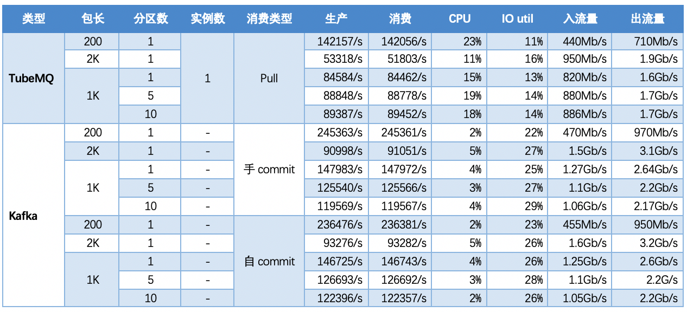
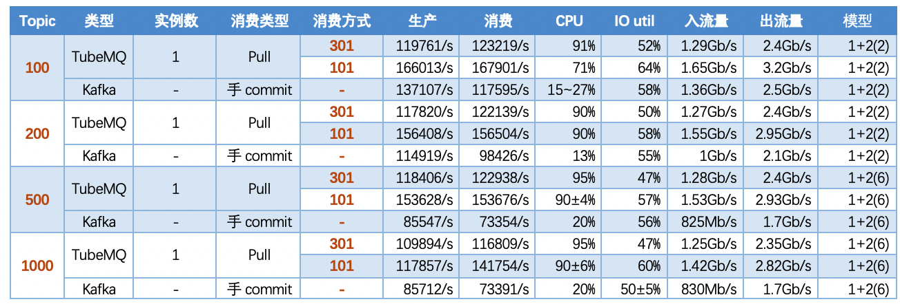
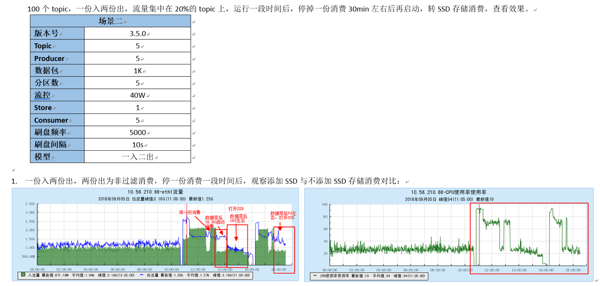
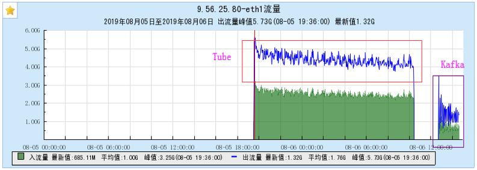
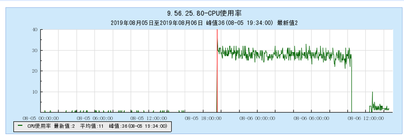
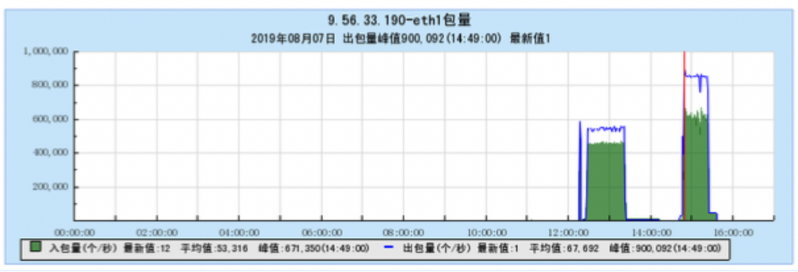

## 1 Background
TubeMQ is a distributed messaging middleware developed by Tencent Big Data. Its system architecture idea comes from [Apache Kafka](http://kafka.apache.org/). In terms of implementation, it adopts a completely adaptive method, and has done a lot of optimization and R&D work in combination with actual combat, such as partition management, distribution mechanism and new node communication process, and self-developed high-performance underlying RPC communication modules.
These implementations make TubeMQ have good robustness and higher throughput on the premise of ensuring real-time and consistency. Combined with the current usage of mainstream message middleware, we take Kafka as a reference for performance comparison test, and compare the performance of the two systems in conventional application scenarios.

## 2 Test scenario scheme
The following is the test plan we designed according to the actual application scenario:

## 3 Test Conclusion
To describe the characters in "The Avengers":

Characters | Test Scenarios | Highlights
:---:|:---:|---
The Flash|Scenario 5|Fast (Data production and consumption delay TubeMQ 10ms vs kafka 250ms)
Hulk|Scenario 3, Scenario 4|Anti-attack capability (as the number of topics gradually increases from 100,200, to 500,1000, the capability of the TubeMQ system does not decrease, the throughput decreases slightly with the increase of load, and the capability is flat vs kafka throughput is obvious Decreased and unstable; when filtering consumption, the increase in inbound and outbound traffic of TubeMQ directly defeats the decline in inbound and outbound traffic of kafka and the decrease in throughput)
Spider-Man|Scenario 8|Each scenario comes and goes freely (comparison test under different models, TubeMQ throughput is stable vs Kafka's lower performance under BX1 model)
Iron Man|Scenario 2, Scenario 3, Scenario 6|Automation (TubeMQ can dynamically adjust system settings and consumption behavior in real time during system operation to improve system performance)

For specific data analysis:
1. Under the single-topic and single-instance configuration, the throughput of TubeMQ is much lower than that of Kafka; under the single-topic multi-instance configuration, the throughput of TubeMQ catches up with Kafka in the configuration of 5 partitions when there are 4 instances, and the throughput of TubeMQ varies with the number of instances. Increases and increases, Kafka does not rise but falls; TubeMQ can dynamically control the throughput improvement by adjusting various parameters during system operation;
2. Under the multi-topic and multi-instance configuration, the throughput of TubeMQ is maintained in a very stable range, and the resource consumption, including the number of file handles and network connection handles, is very low; the throughput of Kafka shows a significant downward trend with the increase of the number of topics. And resource consumption increases sharply; under the condition of SATA disk storage, as the configuration of the model improves, the throughput of TubeMQ can be directly pressed to the disk bottleneck, while Kafka is in an unstable state; in the case of CG1 model SSD disk, Kafka's The throughput is better than TubeMQ;
3. When filtering consumption, TubeMQ can greatly reduce the network outbound traffic of the server, and at the same time, the resources consumed by filtering consumption are less than the full consumption, which in turn promotes the throughput of TubeMQ; kafka has no server-side filtering, outflow and full volume Consistent consumption, no significant savings in traffic;
4. There are differences in resource consumption: TubeMQ uses sequential writing and random reading, which consumes a lot of CPU. Kafka uses sequential writing and block reading, which consumes very little CPU, but other resources, such as file handles and network connections, consume a lot of money. In the actual operating environment in SAAS mode, Kafka will have system bottlenecks due to zookeeper dependence, and there will be more restrictions due to production, consumption, and brokers, such as file handles, network connections, etc., and resource consumption will be higher. Big;

## 4 Test environment and configuration
### 4.1 [Software version and deployment environment]

**Role**|**TubeMQ**|**Kafka**
:---:|---|---
**Software Version**|tubemq-3.8.0|Kafka\_2.11-0.10.2.0
**zookeeper deployment**|Not on the same machine as the Broker, single machine|Not on the same machine as the Broker configuration, single machine
**Broker Deployment**|Single Machine|Single Machine
**Master deployment**|Not on the same machine as the Broker, single machine|Not involved
**Producer**|1 M10 + 1 CG1|1 M10 + 1 CG1
**Consumer**|6 TS50 10G machines|6 TS50 10G machines

### 4.2 [Broker hardware model configuration]

**Model**|Configuration|**Remarks**
:---:|---|---
**TS60**|(E5-2620v3\*2/16G\*4/SATA3-2T\*12/SataSSD-80G\*1/10GE\*2) Pcs|If not specified, the default is TS60 Test comparison on the model
**BX1-10G**|SA5212M5(6133\*2/16G\*16/4T\*12/10GE\*2) Pcs|
**CG1-10G**|CG1-10G\_6.0.2.12\_RM760-FX(6133\*2/16G\*16/5200-480G\*6 RAID/10GE\*2)-ODM Pcs |

### 4.3 [Broker system configuration]

| **Configuration Items** | **TubeMQ Broker** | **Kafka Broker** |
|:---:|---|---|
| **Log Storage** | SATA disk or SSD disk processed by Raid10 | SATA disk or SSD disk processed by Raid10 |
| **Startup parameters** | BROKER_JVM_ARGS="-Dcom.sun.management.jmxremote -server -Xmx24g -Xmn8g -XX:SurvivorRatio=6 -XX:+UseMembar -XX:+UseConcMarkSweepGC -XX:+CMSParallelRemarkEnabled -XX:+ CMSScavengeBeforeRemark -XX:ParallelCMSThreads=4 -XX:+UseCMSCompactAtFullCollection -verbose:gc -Xloggc:$BASE_DIR/logs/gc.log.`date +%Y-%m-%d-%H-%M-%S` - XX:+PrintGCDetails -XX:+PrintGCDateStamps -XX:+CMSClassUnloadingEnabled -XX:CMSInitiatingOccupancyFraction=75 -XX:CMSFullGCsBeforeCompaction=1 -Dsun.net.inetaddr.ttl=3 -Dsun.net.inetaddr.negative.ttl=1 -Dtubemq .fast_boot=false -Dtubemq.home=$tubemq_home -cp $CLASSPATH"|KAFKA_HEAP_OPTS="-Xms24g -Xmx24g -XX:PermSize=48m -XX:MaxPermSize=48m -XX:+UseG1GC -XX:MaxGCPauseMillis=20 -XX: InitiatingHeapOccupancyPercent=35
| **Configuration file** | Changed on the broker.ini configuration file of tubemq-3.8.0 version: consumerRegTimeoutMs=35000 tcpWriteServiceThread=50 tcpReadServiceThread=50 primaryPath is the SATA disk log directory |Changes in the server.properties configuration file of version kafka_2.11-0.10.2.0: log.flush.interval.messages=5000 log.flush.interval.ms=10000 log.dirs SATA disk log directory socket.send.buffer.bytes=1024000 socket.receive.buffer.bytes=1024000 socket.request.max.bytes=2147483600 log. segment.bytes=1073741824 num.network.threads=25 num.io.threads=48 log.retention.hours=5
| **Others** | Unless specified in the test case, set each topic when it is created: memCacheMsgSizeInMB=5 memCacheFlushIntvl=20000 memCacheMsgCntInK=10  unflushThreshold=5000< br/>unflushInterval=10000 unFlushDataHold=5000 | Setting in client code: Production side: props.put("key.serializer", "org.apache.kafka.common. serialization.StringSerializer"); props.put("value.serializer", "org.apache.kafka.common.serialization.StringSerializer"); props.put("linger.ms", " 200"); props.put("block.on.buffer.full", false); props.put("max.block.ms", "10");  props.put("batch.size", 50000); props.put("buffer.memory", 1073741824 ); props.put("metadata.fetch.timeout.ms", 30000) ; props.put("metadata.max.age.ms", 1000000); props.put("request.timeout.ms", 1000000); Consumer: props.put(ConsumerConfig.SESSION_TIMEOUT_MS_CONFIG, "30000");  props.put(ConsumerConfig.KEY_DESERIALIZER_CLASS_CONFIG, "org.apache.kafka.common.serialization.StringDeserializer"); props.put( ConsumerConfig.VALUE_DESERIALIZER_C LASS_CONFIG, "org.apache.kafka.common.serialization.StringDeserializer"); props.put(ConsumerConfig.ENABLE_AUTO_COMMIT_CONFIG, true/false); props.put(ConsumerConfig.AUTO_COMMIT_INTERVAL_MS_CONFIG, "10000") ;

## 5 Test scenarios and conclusions

### 5.1 Scenario 1: Basic scenario, single topic situation, one input and two output models, using different consumption modes, message packets of different sizes, and partitions to scale horizontally, comparing the performance of TubeMQ and Kafka

#### 5.1.1 【Conclusion】

In the case of a single topic with different partitions:
1. The throughput of TubeMQ does not change with the change of partitions. At the same time, TubeMQ belongs to the sequential write and random read mode. In the case of a single instance, the throughput is lower than that of Kafka, and the CPU is higher than that of Kafka;
2. The throughput of Kafka decreases slightly with the increase of partitions, and the CPU usage is very low;
3. Since TubeMQ partitions are logical partitions, increasing the partitions will not affect the throughput; Kafka partitions are the increase of physical files, but increasing the inbound and outbound traffic of the partitions will actually decrease;

####5.1.2 【Indicators】

### 5.2 Scenario 2: Single topic situation, one input and two output model, fixed consumption package size, number of horizontal scaling instances, performance comparison between TubeMQ and Kafka

#### 5.2.1 【Conclusion】

From the combination of test data of scenario 1 and scenario 2:

1. As the number of instances increases, the throughput of TubeMQ increases. When there are 4 instances, the throughput is the same as that of Kafka, the usage of disk IO is lower than that of Kafka, and the usage of CPU is higher than that of Kafka;
2. The consumption mode of TubeMQ affects the throughput of the system. The performance of the memory read mode (301) is lower than that of the file read mode (101), but it can reduce the delay of messages;
3. Kafka does not improve the system throughput as scheduled as the number of partition instances increases;
4. After TubeMQ increases the instances (physical files) equivalent to Kafka, the throughput increases accordingly, and the test effect reaches and exceeds that of Kafka when there are 4 instances.
   The status of 5 partitions; TubeMQ can adjust the data reading method according to the needs of business or system configuration, which can dynamically improve the throughput of the system; as the number of partitions increases, the incoming traffic of Kafka decreases;

#### 5.2.2 【Indicators】

**Note 1:** In the following scenarios, they are all tests in different partitions or instances, and in different read mode scenarios under a single topic test, and the length of a single message packet is 1K;

**Note 2:**In read mode, set qryPriorityId to the corresponding value through admin\_upd\_def\_flow\_control\_rule.

### 5.3 Scenario 3: Multi-topic scenario, fixed message packet size, number of instances and partitions, and investigate the performance of TubeMQ and Kafka in 100, 200, 500, and 1000 topic scenarios

#### 5.3.1 【Conclusion】

Test in multi-topic scenarios:

1. As the number of topics in TubeMQ increases, the production and consumption performance maintains an average line, there is no particularly large traffic fluctuation, and the number of file handles, memory, and network connections occupied is not large (1k
   There are about 7500 file handles under topic and 150 network connections), but the CPU usage is relatively large;
2. After TubeMQ has changed the consumption mode from memory consumption to file consumption, the throughput has increased greatly, the CPU usage has decreased, and services with different performance requirements can be differentiated;
3. As the number of topics increases, the throughput of Kafka decreases significantly. At the same time, the Kafka traffic fluctuates violently, the storage and consumption lag in long-term operation, and the throughput decreases obviously, and the number of memory, file handles, and network connections is very large. (at 1K
   When Topic is configured, the network connection reaches 1.2W, and the file handle reaches 4.5W) and other problems;
4. In terms of data comparison, TubeMQ runs more stably than Kafka, the throughput is presented in a stable situation, the throughput does not drop for a long time, and the resource occupation is small, but the CPU occupation needs to be solved in subsequent versions;

#### 5.3.2 【Indicators】

**Note:** In the following scenarios, the package length is 1K and the number of partitions is 10.

### 5.4 Scenario 4: 100 topics, one input and one full output Five partial filtering: one full topic's Pull consumption; filtering consumption using 5 different consumption groups, filtering out 10 from the same 20 topics 10% Message content

#### 5.4.1 【Conclusion】

1. TubeMQ adopts the mode of server-side filtering, and there is a significant difference between outgoing traffic indicators and incoming traffic;
2. TubeMQ server-side filtering provides more resources for production, and the production performance is improved compared to the non-filtering situation;
3. Kafka adopts the client-side filtering mode, the incoming traffic is not improved, the outgoing traffic is almost twice the incoming traffic, and the incoming and outgoing traffic is unstable;

#### 5.4.2 【Indicators】

**Note:** In the following scenario, the topic is 100, the packet length is 1K, and the number of partitions is 10

### 5.5 Scenario 5: Comparison of Data Consumption Latency between TubeMQ and Kafka

| Type | Delay | Ping Delay |
|---|---|---|
| TubeMQ | 90% data within 10ms± | C->B: 0.05ms ~ 0.13ms, P->B: 2.40ms ~ 2.42ms |
| Kafka | 90% concentrated in 250ms± | C->B: 0.05ms ~ 0.07ms, P-\>B: 2.95ms \~ 2.96ms |

Remarks: There is a situation in the consumer side of TubeMQ that the data is not found when waiting for the queue processing message to equalize the production. The default waiting delay is 200ms. When testing this item, the TubeMQ consumer should adjust the pull delay (ConsumerConfig.setMsgNotFoundWaitPeriodMs()) to 10ms, or set the frequency control policy to 10ms.

### 5.6 Scenario 6: The impact of adjusting the memory cache size (memCacheMsgSizeInMB) of topic configuration on throughput

#### 5.6.1 【Conclusion】

1. TubeMQ's adjustment of the topic's memory cache size can have a positive impact on throughput, and it can be adjusted reasonably according to the machine conditions in actual use;
2. From the actual usage, the memory size setting is not as large as possible, and the value needs to be set reasonably;

#### 5.6.2 【Indicators】

**Note:** In the following scenarios, the consumption method is to read the PULL consumption of memory (301), and the length of a single message packet is 1K

#### 5.7.2 【Indicators】

### 5.8 Scenario 8: Evaluate the performance of the two systems in the case of multiple models

#### 5.8.1 [Conclusion]

1. TubeMQ has a higher throughput under the BX1 model than the TS60 model. At the same time, because the IO util reaches the bottleneck, it cannot be improved any more. The throughput of the CG1 model has a higher index value than that of the BX1 model;
2. The system throughput of Kafka under the BX1 model is unstable, and it is lower than that tested under the TS60 model. Under the CG1 model, the system throughput reaches the highest level, and the 10G network card is full;
3. Under the condition of SATA disk storage, the performance indicators of TubeMQ have been significantly improved with the improvement of hardware configuration; the performance indicators of Kafka have not increased but decreased with the improvement of hardware models;
4. Under the condition of SSD disk storage, Kafka has the best performance indicators, and TubeMQ indicators are not as good as Kafka;
5. The data storage disk of the CG1 model is small (only 2.2T), and the disk will be full within 90 minutes under the RAID 10 configuration, so it is impossible to test the long-term operation of the two systems.

#### 5.8.2 【Indicators】

**Note 1:** In the following scenarios, the topic number is configured with 500 topics, 10 partitions, and the message packet size is 1K bytes;

**Note 2:** TubeMQ uses 301 memory read mode consumption;

## 6 Appendix
### 6.1 Appendix 1 Resource occupancy chart for different models:
#### 6.1.1 [BX1 model test]

#### 6.1.2 [CG1 model test]

### 6.2 Appendix 2 Resource occupancy chart for multi-topic testing:

#### 6.2.1 [100 topics]

#### 6.2.2 [200 topics]

#### 6.2.3 [500 topics]

#### 6.2.4 [1000 topics]

---
<a href="#top">Back to top</a>