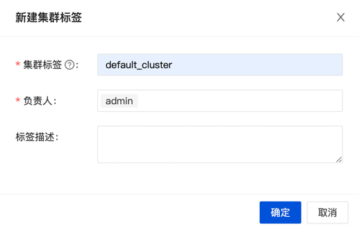
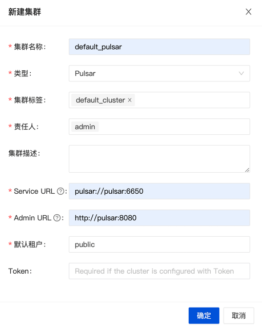

通过 Docker Compose 部署 InLong，这种部署方式只适用于开发与调试，不适用于生产环境。

:::note
Docker Compose 部署了`标准架构`所需要的所有组件，使用 [Apache Pulsar](https://pulsar.apache.org/docs/concepts-overview) 作为消息队列服务。
:::

## 环境要求
- [Docker](https://docs.docker.com/engine/install/) 19.03.1+
- [Docker Compose 2.4+](https://docs.docker.com/compose/install/other/#on-linux)

## 下载
你可以从 [下载页面](https://inlong.apache.org/zh-CN/download/) 获取 `apache-inlong-[version]-bin.tar.gz`，或者参考 [How to Build](quick_start/how_to_build.md) 编译。

## 部署
启动所有组件：
```
cd docker/docker-compose
docker-compose up -d
```

## 集群初始化
当所有容器都成功启动后，可以访问 InLong Dashboard 地址`http://localhost`，并使用以下默认账号登录:
```
User: admin
Password: inlong
```

### 创建集群标签
页面点击 [集群管理]->[标签管理]->[新建]，指定集群标签名称和负责人：


:::caution
由于各个组件默认上报集群标签为 `default_cluster`，请勿使用其它名称。
:::

### 注册 Pulsar 集群
页面点击 [集群管理]->[集群管理]->[新建集群]，注册 Pulsar 集群：


:::note
集群标签选择刚创建的 `default_cluster`，docker 部署的 Pulsar 集群：

Service URL 为 `pulsar://pulsar:6650`，Admin URL 为 `http://pulsar:8080`。
:::

## 使用
创建数据流可以参考 [Pulsar Example](quick_start/pulsar_example.md).

## 销毁
```
docker-compose down
```
