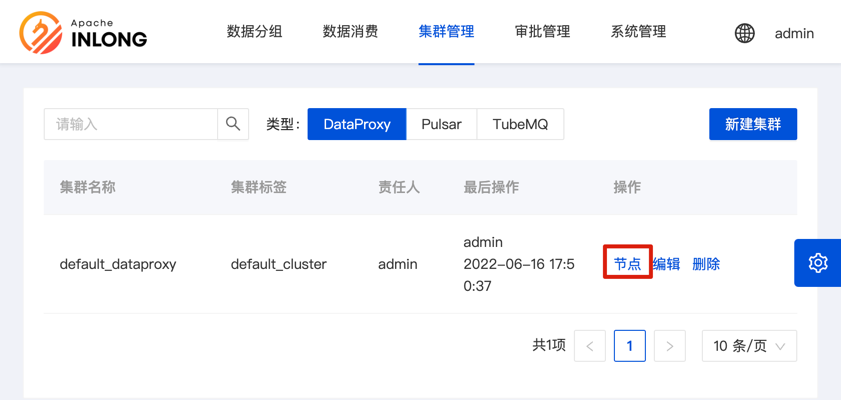
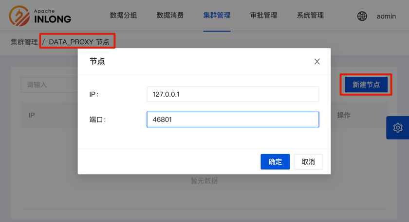

所有的安装文件都在 `inlong-dataproxy` 目录下。

## 配置

### 配置 InLong-Manager 地址

配置文件：`conf/common.properties`：

```
# local IP
proxy.local.ip=127.0.0.1
# manager 地址
manager.hosts=127.0.0.1:8083
# audit proxy 地址
audit.proxys=127.0.0.1:10081
```

## 启动

```
# 默认使用 Pulsar 来缓存数据，加载 dataproxy-pulsar.conf 配置文件
bash +x bin/dataproxy-start.sh
# 或者
bash +x bin/dataproxy-start.sh pulsar

# 如果使用 Inlong TubeMQ 来缓存数据
# bash +x bin/dataproxy-start.sh tubemq

# 如果使用 Kafka 来缓存数据
# bash +x bin/dataproxy-start.sh kafka
```

## 检查

```
telnet 127.0.0.1 46801
```

## 将 DataProxy 注册到 InLong-Manager

安装完 DataProxy 后，需要将 DataProxy 服务的 IP 添加到 InLong-Manager 中。

打开 Inlong-Dashboard 页面（默认是 <http://127.0.0.1>），在 [集群管理] 页签中选择添加 DataProxy 集群：


点击 [新建集群] 按钮，在弹出的框中填写 集群名称、集群标签、责任人 即可保存。

> 说明：[集群标签] 是一个逻辑概念，同名的标签将被视为同一套集群，比如相同集群标签的 DataProxy 集群和 Pulsar 集群，属于同一套集群。

然后为此 DataProxy 集群添加节点 —— 一个 DataProxy 集群可以支持添加多个节点：



填写 DataProxy 节点的 IP 和端口即可。


