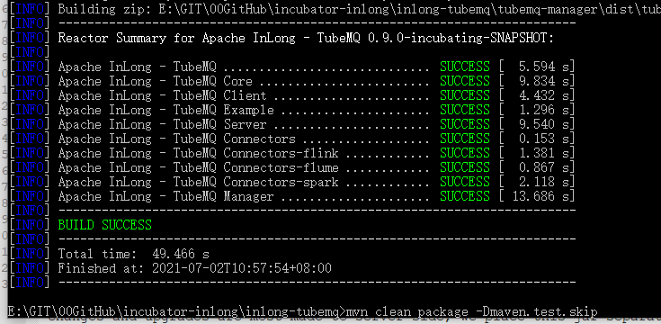
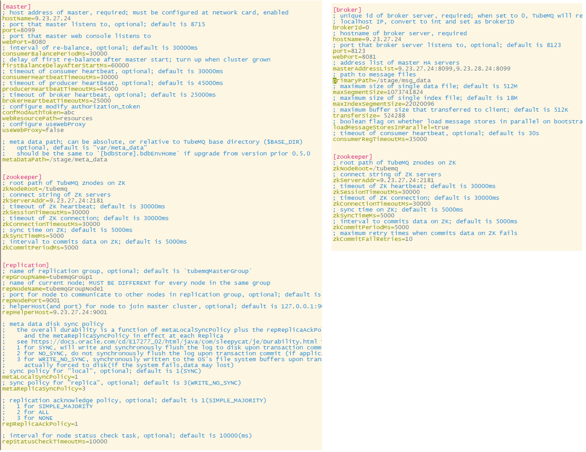
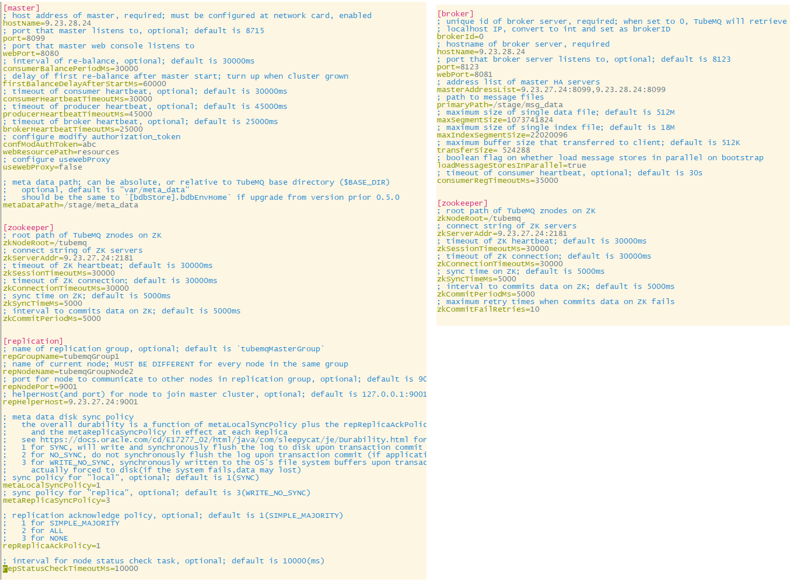
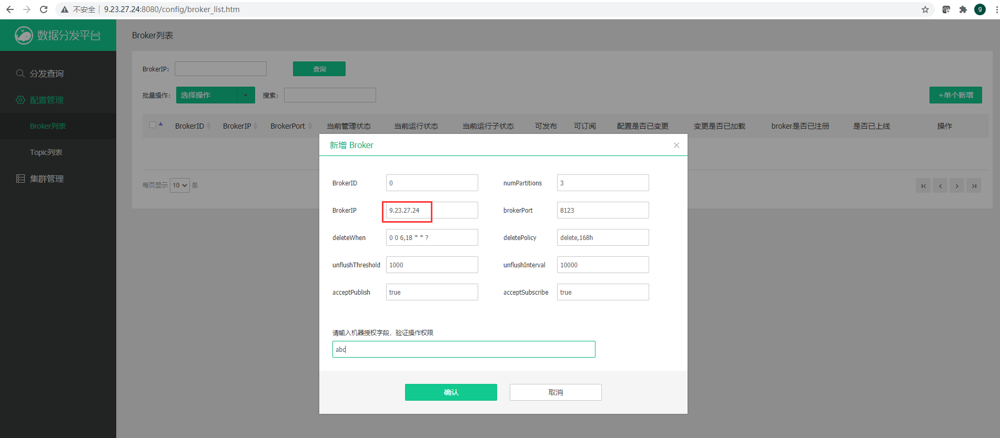
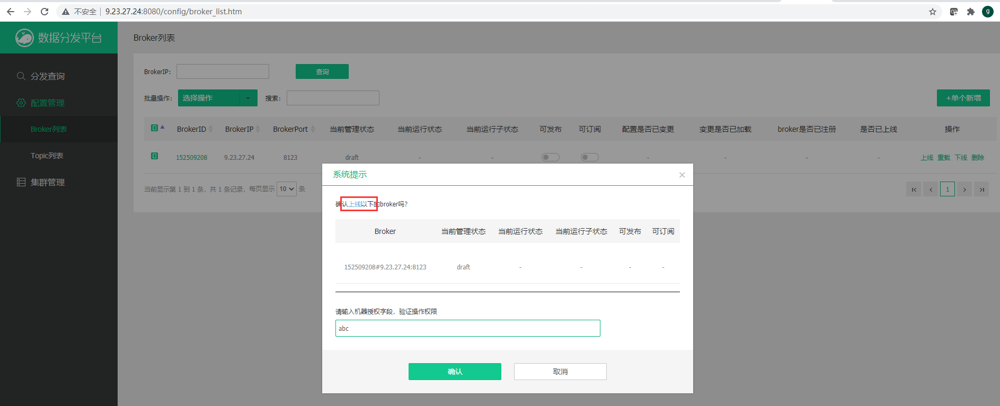
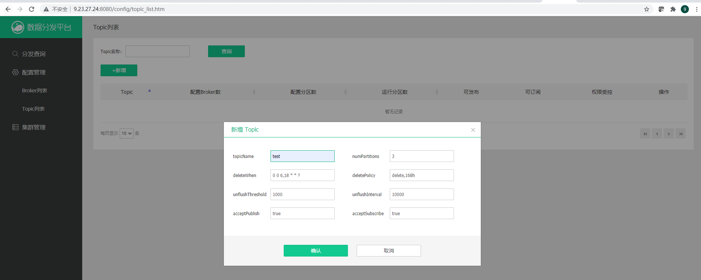

## 1 工程编译打包：

进入工程根目录,执行命令：

```
mvn clean package -Dmaven.test.skip
```

例如将TubeMQ源码包放在E盘根目录，按照如下方式执行上述命令，当各个子目录都编译成功时工程编译完成：



大家也可以进入各个子目录进行单独编译，编译过程与普通的工程编译处理过程一致。

## 2 部署服务端：
如上例子，进入..\InLong\inlong-tubemq\tubemq-server\target目录，服务侧的相关内容如下，其中apache-inlong-tubemq-server-0.9.0-incubating-SNAPSHOT-bin.tar.gz为完整的服务端安装包，里面包括执行脚本，配置文件，依赖包，以及前端的源码；apache-inlong-tubemq-server-0.9.0-incubating-SNAPSHOT.jar为服务端处理逻辑包，包含于完整工程安装包的lib里，单独提出是考虑到日常变更升级时改动点多在服务器处理逻辑上，升级的时候只需要单独替换该jar包即可：


这里我们是全新安装，将上述完整的工程安装包部署到待安装机器上，我们这里是放置在/data/inlong目录下：


## 3 配置系统：

服务包里打包了3种角色：Master、Broker、Tools，业务使用时可以将Master和Broker放置在一起，也可以单独分开不同机器放置，依照业务对机器的规划进行处理。我们通过如下3台机器搭建一个完整的有2台Master的生产、消费环境：

| 机器 | 所属角色 | TCP端口 | TLS端口 | WEB端口 | 备注 |
| --- | --- | --- | --- | --- | --- |
| 9.23.27.24 | **Master** | 8099 | 8199 | 8080 | 元数据存储在`/stage/meta_data` |
| | Broker | 8123 | 8124 | 8081 | 消息储存在`/stage/msg_data` |
| | ZooKeeper | 2181 | | | Offset储存在根目录`/tubemq` |
| 9.23.28.24 | **Master** | 8099 | 8199 | 8080 | 元数据存储在 `/stage/meta_data` |
| | Broker | 8123 | 8124 | 8081 | 消息储存在`/stage/msg_data` |
| 9.23.27.160 | Producer ||||
| | Consumer ||||
|
部署Master时需要注意：

1. 部署Master的机器，Master集群可以部署1台、2台或者3台：如果要保证高可靠建议3台（任意坏1台Master对外仍然可读写配置及接入新的生产或者消费），如果只需要保证一般情况2台（任意坏1台Master对外仍然可读配置及已接入的生产和消费不受影响），最低1台（坏1台Master对外配置不可读写及已接入的生产和消费不受影响）；
2. 在完成Master的规划后，对于配置Master的机器，需要将Master所在机器加入时间同步，同时Master各个机器的IP要在各个Master机器的/etc/hosts配置里进行设置，如：


以9.23.27.24和9.23.28.24为例，我们部署了Master和Broker两种角色，需要在/conf/master.ini，/resources/velocity.properties，/conf/broker.ini里进行如下配置，首先是9.23.27.24的配置：



然后是配置9.23.28.24：



要注意的是右上角的配置为Master的Web前台配置信息，需要根据Master的安装路径修改/resources/velocity.properties里的file.resource.loader.path信息。

## 4 运行节点
### 4.1 启动Master：

完成如上配置设置后，首先进入主备Master所在的TubeMQ环境的bin目录，进行服务启动操作：


我们首先启动9.23.27.24，然后启动9.23.28.24上的Master，如下打印可以表示主备Master都已启动成功并开启了对外服务端口：


访问Master的管控台([http://9.23.27.24:8080](http://9.23.27.24:8080) )，点击页面可以查看到如下集群信息，则表示master已成功启动：


### 4.2 启动Broker：

启动Broker和启动master有些差别：Master负责管理整个TubeMQ集群，包括Broker节点运行管理以及节点上部署的Topic配置管理，还有生产和消费管理等，因此，实体的Broker启动前，首先要在Master上配置Broker元数据，增加Broker相关的管理信息，如下图示：



点击确认后形成一个草稿的Broker记录：


我们对该broker节点进行启动操作：


结果发现报错信息：


因为该broker目前还处在草稿状态Broker信息没有正式生效，我们回到Master管控台进行上线生效操作：



Master上所有的变更操作在点击确认的时候，都会弹出如上输入框，要求输入操作授权码。该信息由运维通过Master的配置文件master.ini的confModAuthToken字段进行定义：如果你知道这个集群的密码，你就可以进行该项操作，比如你是管理员，你是授权人员，或者你能登陆这个master的机器拿到这个密码，都认为你是有权操作该项功能：


然后我们再重启Broker：


查看Master管控台，broker已经注册成功：


## 5 数据生产和消费
### 5.1 配置及生效Topic：

配置Topic和配置Broker信息类似，都需要先在Master上新增元数据信息，然后才能开始使用，要不生产和消费时候会报topic不存在错误，如我们用安装包里的example对不存在的Topic名test进行生产：


Demo实例会报如下错误信息：


我们在Master管控台的Topic列表上加入该Topic先：




点击确认后会有一个选择部署该新增Topic的Broker列表，选择部署范围后进行确认操作；在完成新增Topic的操作后，我们还需要对刚进行变更的配置对Broker进行重载操作，如下图示：


重载完成后Topic才能对外使用，我们会发现如下配置变更部分在重启完成后已改变状态：


**大家需要注意的是：** 我们在重载的时候，要对待重载的Broker集合分批次进行。我们的重载通过状态机进行控制，会先进行不可读写—〉只读操作—〉可读写—〉上线运行各个子状态处理，如果所有待重启Broker全量重载，会使得已在线对外服务的Topic对外出现短暂的不可读写状况，使得生产、消费，特别是生产发送失败。

### 5.2 数据生产和消费：

在安装包里，我们打包了example的测试Demo，业务也可以直接使用tubemq-client-0.9.0-incubating-SNAPSHOT.jar封装自己的生产和消费逻辑，总的形式是类似，我们先执行生产者的Demo，我们可以看到Broker上已开始有数据接收：


我们再执行消费Demo，我们也可以看到消费也正常：


在Broker的生产和消费指标日志里，相关数据已经存在：


在这里，已经完成了TubeMQ的编译，部署，系统配置，启动，生产和消费。如果需要了解更深入的内容，就需要查看《TubeMQ HTTP API》里的相关内容，进行相应的配置设置。

---
<a href="#top">Back to top</a>
