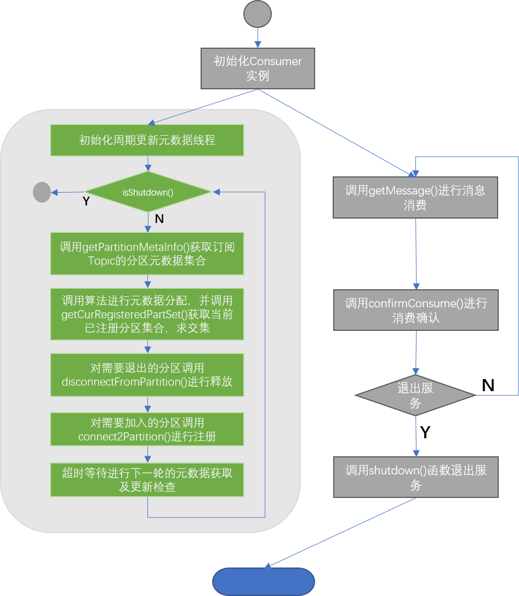
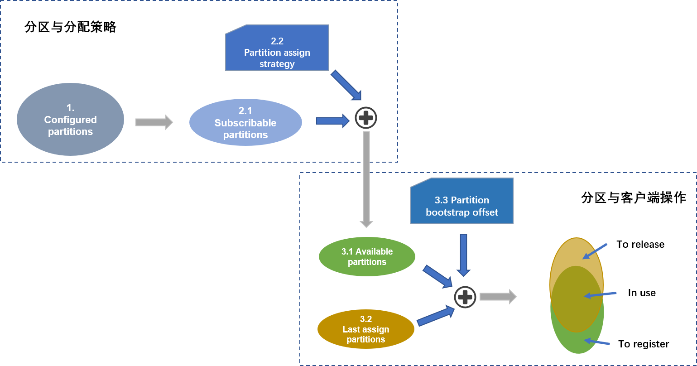

## 1 前言
在0.12.0版本以前，TubeMQ的分区分配都是由服务侧进行管控，这种方案的优势在于客户端实现简单，客户端注册后只需要等待服务侧派发分区，并对派发的分区进行注册消费即可，其缺点也比较明显：
1. 数据消费等待时间过长： 客户端从启动到消费到第一条数据的时间比较长，主要原因在于服务侧是按照固定周期进行消费分区的任务分配，且过程中涉及到客户端对已分配分区的资源释放，客户端在最好的情况下都需要等待一个分配周期（可配置，默认30秒）才能获取到待消费分区，在极端情况下有可能超过几分钟，对业务及时消费到数据不满足；
2. 分区分配方案不够丰富： 当前服务侧分区分配方案是按照客户端订阅的Topic分区总集合，与这个消费组分区分配时的总客户端个数进行Hash取模的方式进行分配，而业务需要采用特别的分配方案时，服务侧目前分配方案则显得不够友好，不能随业务需要随时变更；
3. 不支持指定分区消费： 在版本使用过程中业务反馈当前服务侧管控不够灵活，比如客户端需要绑定消费者与分区的消费关系，或者某次启动只想消费其中某几个分区时，当前服务侧消费管控不支持。
针对这些问题，0.12.0版本上线了新的客户端分区分配管控消费模式，结合分区当前消费滞后情况感知功能，让业务自主控制分区的分配和消费。

## 2 使用示例
客户端分区分配基于ClientBalanceConsumer接口类进行定义，一共17个API，相关的使用示例代码参考示例代码[ClientBalanceConsumerExample.java](https://github.com/apache/incubator-inlong/blob/master/inlong-tubemq/tubemq-example/src/main/java/org/apache/inlong/tubemq/example/ClientBalanceConsumerExample.java) 。总的代码实现逻辑如下图示：

## 3 实现方案
### 3.1 总的思路
根据业务需求以及同类MQ的实现分析，我们在TubeMQ消费端增加ClientBalanceConsumer类，通过该SDK提供的API，业务可以定期查询待消费的Topic对应的分区集合信息；并且业务可以通过API对指定分区以及初始offset进行注册，以及注销之前已经注册的分区；同时服务端不管理该类消费组的分区分配，完全由客户端控制客户端与分区的分配、释放关系。

### 3.2 字段定义
在使用该类消费者前，业务需要注意如下2个字段信息定义：
- PartitionKey： 分区Key，String类型，TubeMQ里用来唯一标识一个分区的ID，集群内全局唯一，格式为“brokerId:Topic名:partitionId”样式，业务查询分区元数据信息时将返回结果为PartitionKey的集合；
- bootstrapOffset： 重置Offset，long类型，业务对指定分区进行注册消费时提供的初始消费值，有效值为[0, +value）；调用该接口时该字段设置为-1表示业务按照服务侧存储的Offset位置接续消费数据

### 4.3 交互介绍
#### 4.3.1 核心思路

如上图示，客户端负载均衡操作背后的逻辑主要是处理分区集合，客户端要定期获取可订阅分区集合，根据分配算法来获取每个客户端当前可消费的分区集合；当前可消费的集合与客户端当前在消费的分区集合取交集，获得需要释放和需要新注册的分区；对于需要新注册的分区，支持客户端指定初始消费的offset值。

客户端分区分配使用中业务需要关注如下2个问题：
- 如何减小分区扩缩容带来的影响： TubeMQ会随时进行扩缩容，比如Broker异常下线、运维进行黑名单操作、运维扩容Topic的分区等，为了应对这个问题，业务拉取到的分区元数据信息为配置信息，以及分区的可订阅状态；建议业务按照配置全集进行分配，然后针对元数据状态进行注销、注册处理（示例代码里有示例），这样可以避免因为Broker异常上下线、黑名单、临时不可订阅等操作带来的频繁释放和加入处理。
- 如何应对客户端侧的扩缩容： 我们缺省认为业务会采用按照分区数与消费组的客户端数进行取模分配分区，因此，我们在TubeMQ的start()函数里增加了sourceCount（消费组的总节点数），nodeId（当前节点的ID号）两个字段，来告诉服务侧该消费组会启动多少客户端，每个客户端的ID号是多少，来保证取模分配的一致性；业务使用消费组时需要指定上述2个参数，sourceCount要确保同一个组里所有的消费者提供的值相同，nodeId要确保同一个组里所有消费者使用的ID是唯一的。通过这个方式确保消费组如果使用取模方案，对应的基础参数是没有冲突的。业务有可能不选取模方案，这个时候只需要设置sourceCount为无效值（小于0），则可关闭该缺省的参数要求。

#### 4.3.2 交互流程
各个节点间的交互如下：

- Master不对客户端管控的Consumer做负载均衡处理：Master收到这类客户端注册的消费组后，不进行负载均衡操作，完全由客户端自己控制；
- Consumer提供分区查询接口，供业务定期查询待消费的Topic集合对应的分区集合信息；
- Consumer提供分区注册、注销接口，供业务对该客户端已注册需注销的分区进行注销操作，通过注册接口对指定未注册的分区进行注册，注册的时候支持业务指定注册的初始offset；
- Consumer定期上报状态及分区注册信息，让Master侧感知各个SDK当前分区分配及注册情况，便于服务端获取整个组的分区分配信息；
- Master提供查询API，支持运维通过API查询接口查询指定分区分配消费组各节点的分区分配情况。

## 5 总结
到这里，我们就完成了客户端分区分配的介绍，并且通过客户端按照分区总数以及消费组里客户端总个数进行hash取模方式为例做了分区分配的详细示例。这里并没有限制分区的分配方案，大家在使用的时候也可以采用其他的方案，只需要将sourceCount值设置为-1，即可关闭系统默认的分配策略。

在实现的时候最初计划是将分配方案以回调方式对外并将分区分配的线程包含到SDK内部，但后来考虑到客户端可能会做非常多的精细处理，封装起来可能反而会限制业务的使用，且相比而言只是业务多创建一个线程，因而目前版本没有进行这块封装。后续看实施的效果，如果这块需要，我们再改进。

---
<a href="#top">Back to top</a>