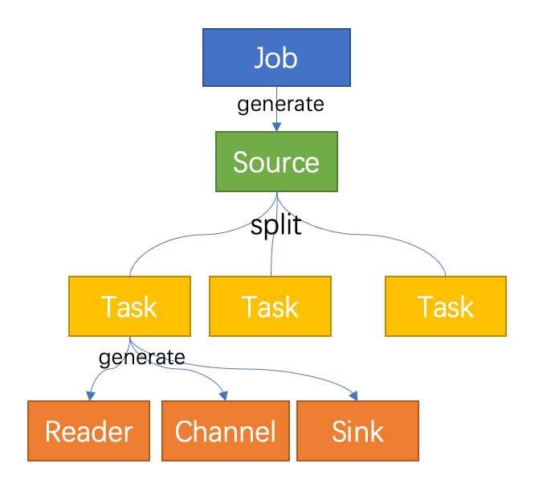

# 总览

本文面向 InLong-Agent 插件开发人员，尝试尽可能全面地阐述开发一个 Agent 插件所经过的历程，力求消除开发者的困惑，让插件开发变得简单。

## 开发之前

InLong Agent 本身作为数据采集框架，采用 Job + Task 架构构建。并将数据源读取和写入抽象成为 Reader/Sink 插件，纳入到整个框架中。

开发人员需要明确 Job 以及 Task 的概念：

- `Job`: `Job`是 Agent 用以描述从一个源头到一个目的端的同步作业，是 Agent 数据同步的最小业务单元。比如：读取一个文件目录下的所有文件
- `Task`: `Task`是把`Job`拆分得到的最小执行单元。比如：文件夹下有多个文件需要被读取，那么一个 job 会被拆分成为多个 task ，每个 task 读取对应的文件

一个Task包含以下各个组件：

- Reader：Reader 为数据采集模块，负责采集数据源的数据，将数据发送给 channel。
- Sink： Sink 为数据写入模块，负责不断向 channel 取数据，并将数据写入到目的端。
- Channel：Channel 用于连接 reader 和 sink，作为两者的数据传输通道，并起到了数据的写入读取监控作用

作为开发人员，实际上只需要开发特定的 Source、Reader 以及 Sink 即可，数据如果需要持久化到本地磁盘，使用持久化 Channel ，如果否则使用内存 Channel

## 流程图示

上述介绍的 Job \ Task \ Reader \ Sink \ Channel 概念可以用下图表示：


1. 用户提交 Job（通过 manager 或者通过 curl 方式提交），Job 中定义了需要使用的 Source, Channel, Sink（通过类的全限定名定义）
2. 框架启动 Job，通过反射机制创建出 Source
3. 框架启动 Source，并调用 Source 的 Split 接口，生成一个或者多个 Task
4. 生成一个 Task 时，同时生成 Reader（一种类型的 Source 会生成对应的 reader)，用户配置的 Channel 以及用户配置的 Sink
5. Task 开始执行，Reader 开始读取数据到 Channel，Sink 从 Channel 中取数进行发送
6. Job 和 Task 执行时所需要的所有信息都封装在 JobProfile 中


## 参考 Demo

请开发人员通过阅读 Agent 源码中的 Job 类、Task 类、TextFileSource 类、TextFileReader 类、以及 ProxySink 类来弄懂上述流程

## 开发流程

1、首先开发 Source , 实现 Split 逻辑，返回 Reader 列表
2、开发对应的 Reader ，实现读取数据并写入到 Channel 的逻辑
3、开发对应的 Sink , 实现从 Channel 中取数并写入到指定 Sink 中的逻辑

## 编程必知接口

下面将介绍开发一款插件需要知道的类与接口，如下：

### Reader
```java
private class ReaderImpl implements Reader {

    private int count = 0;

    @Override
    public Message read() {
        count += 1;
        return new DefaultMessage("".getBytes(StandardCharsets.UTF_8));
    }

    @Override
    public boolean isFinished() {
        return count > 99999;
    }

    @Override
    public String getReadSource() {
        return null;
    }

    @Override
    public void setReadTimeout(long mill) {

    }
}
```

`Reader`接口功能如下：
- `read`: 被单个 Task 调用，调用后返回读取的一条消息，Agent 内部的消息使用 Message 封装
- `isFinished`: 判断是否读取完成，举例：如果是 SQL 任务，则判断是否读取完了 ResultSet 中的所有内容,如果是文件任务，则判断超过用户设置的等待时间后是否还有数据写入
- `getReadSource`: 获取采集源，举例：如果是文件任务，则返回当前读取的文件名
- `setReadTimeout`: 设置读取超时时间

### Sink

```java
public interface Sink extends Stage {

    /**
     * Write data into data center
     *
     * @param message - message
     */
    void write(Message message);

    /**
     * set source file name where the message is generated
     * @param sourceName
     */
    void setSourceName(String sourceName);

    /**
     * every sink should include a message filter to filter out stream id
     */
    MessageFilter initMessageFilter(JobProfile jobConf);
}

```

`Sink`接口功能如下：
- `write`: 被单个 Task 调用，从 Task 中的 Channel 读取一条消息，并写入到特定的存储介质中，以 PulsarSink 为例，则需要通过 PulsarSender 发送到 Pulsar
- `setSourceName`: 设置数据源名称，如果是文件，则是文件名
- `initMessageFilter`: 初始化 MessageFilter , 用户可以在Job配置文件中通过设置 agent.message.filter.classname 来创建一个消息过滤器来过滤每一条消息，详情可以参考 MessageFilter 接口


### Source

```java
/**
 * Source can be split into multiple reader.
 */
public interface Source {

    /**
     * Split source into a list of readers.
     *
     * @param conf job conf
     * @return - list of reader
     */
    List<Reader> split(JobProfile conf);
}

```

`Source`接口功能如下：
- `split`: 被单个 Job 调用，产生多个 Reader，举例：一个读取文件任务，匹配文件夹内的多个文件，在 job 启动时，会指定 TextFileSource 作为 Source 入口，
  调用 split 函数后，TextFileSource 会检测用户设置的文件夹内有多少符合路径匹配表达式的路径，并生成 TextFileReader 读取
  

## 任务配置

代码写好了，有没有想过框架是怎么找到插件的入口类的？框架是如何加载插件的呢？

在提交任务时，会发现任务中定义了插件的相关信息，包括入口类。例如：

```json
{
"job": {
"name": "fileAgentTest",
"source": "org.apache.inlong.agent.plugin.sources.TextFileSource",
"sink": "org.apache.inlong.agent.plugin.sinks.ProxySink",
"channel": "org.apache.inlong.agent.plugin.channel.MemoryChannel"
}
}
```

- `source`: Source 类的全限定名称，框架通过反射插件入口类的实例。
- `sink`: Sink 类的全限定名称，框架通过反射插件入口类的实例。
- `channel`: 使用的 Channel 类名，框架通过反射插件入口类的实例。

## Message

跟一般的`生产者-消费者`模式一样，`Reader`插件和`Sink`插件之间也是通过`channel`来实现数据的传输的。
`channel`可以是内存的，也可能是持久化的，插件不必关心。插件通过`RecordSender`往`channel`写入数据，通过`RecordReceiver`从`channel`读取数据。

`channel`中的一条数据为一个`Message`的对象，`Message`中包含一个字节数组以及一个Map表示的属性数据

`Message`有如下方法：

```java
public interface Message {

    /**
     * Data content of message.
     *
     * @return bytes body
     */
    byte[] getBody();

    /**
     * Data attribute of message
     *
     * @return map header
     */
    Map<String, String> getHeader();
}
```

开发人员可以根据该接口拓展定制化的 Message ，比如 ProxyMessage 中，就包含了 InLongGroupId, InLongStreamId 等属性

## Last but not Least

新增插件都必须在`InLong`官方wiki中有一篇文档，文档需要包括但不限于以下内容：

1. **快速介绍**：介绍插件的使用场景，特点等。
2. **实现原理**：介绍插件实现的底层原理，比如`sqlReader`通过执行Sql查询来读取数据库中的数据
3. **配置说明**
    - 给出典型场景下的同步任务的json配置文件。
    - 介绍每个参数的含义、是否必选、默认值、取值范围和其他约束。
4. **约束限制**：是否存在其他的使用限制条件。
5. **FAQ**：用户经常会遇到的问题。
