## 1 总体介绍：

这部分介绍内容在/org/apache/inlong/tubemq/corerpc模块下可以找到对应实现，Apache InLong TubeMQ模块的各个节点间（Client、Master、Broker）通过TCP协议长连接交互，其消息采用的是 【二进制 + Protobuf编码】组合方式进行定义，如下图示：
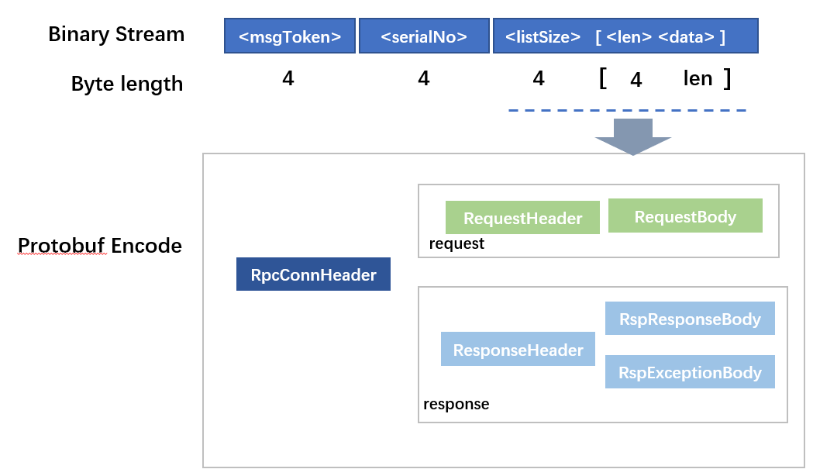

在TCP里我们看到的都是二进制流，我们定义了4字节的msgToken消息头字段RPC\_PROTOCOL\_BEGIN\_TOKEN，用来区分每一条消息以及识别对端的合法性，客户端收到的消息不是以该字段开始的响应消息时，说明连接方非本系统支持的协议，或者返回数据出现了异常，这个时候需要关闭该连接，提示错误退出或者重连；紧接着的是4字节的消息序列号serialNo，该字段由请求方生成通过请求消息携带给服务端，服务器端完成该请求消息服务后通过请求消息的对应响应消息原样返回，主要用于客户端关联请求响应的上下文；4字节的listSize字段表示接下来按照PB编码的数据块个数，即后面跟随的[\&lt;len\&gt;\&lt;data\&gt;]内容的块数，目前协议定义下该字段不为0；[\&lt;len\&gt;\&lt;data\&gt;]是2个字段组合，即数据块长度，数据，主要是表示这个数据块长度及具体的数据。

为什么会以listSize [\&lt;len\&gt;\&lt;data\&gt;]形式定义pb数据内容？因为在TubeMQ的这个实现中，序列化后的PB数据是通过ByteBuffer对象保存的，Java里ByteBuffer存在一个最大块长8196，超过单个块长度的PB消息内容就需要用多个ByteBuffer保存，序列化到TCP消息时候，这块没有统计总长，直接按照PB序列化的ByteBuffer列表写入到了消息中。 **在多语言实现时候，这块需要特别注意：** 需要将PB数据内容序列化成块数组（pb编解码里有对应支持）。

## 2 PB格式编码：

PB格式编码分为RPC框架定义，到Master的消息编码和到Broker的消息编码三个部分，大家采用protobuf直接编译就可以获得不同语言的编解码，使用起来非常的方便：

RPC.proto定义了6个结构，分为2大类：请求消息与响应消息，响应消息里又分为正常的响应返回以及抛异常情况下的响应返回：

请求消息编码及响应消息解码可以参考NettyClient.java类实现，这个部分的定义存在一些改进空间，具体见【[TUBEMQ-109](https://issues.apache.org/jira/browse/TUBEMQ-109)】，但由于兼容性考虑，会逐步的替换，我们按照当前proto版本实现至少在1.0.0版本前交互不是问题，但1.0.0时会考虑用新协议，协议实现模块需要各个SDK预留出改进空间。以请求消息填写为例，RpcConnHeader等相关结构如下：
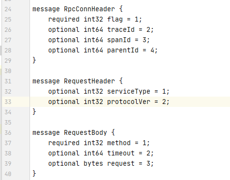

其中flag标记的是否请求消息，后面3个标记的是消息跟踪的相关内容，目前没有使用；相关的服务类型，协议版本，服务类型等是固定的映射关系，比较关键的一个参数RequestBody.timeout是一个请求被服务器收到到实际处理时的最大允许等待时间长，超过就丢弃，目前缺省为10秒，请求填写具体见如下部分：
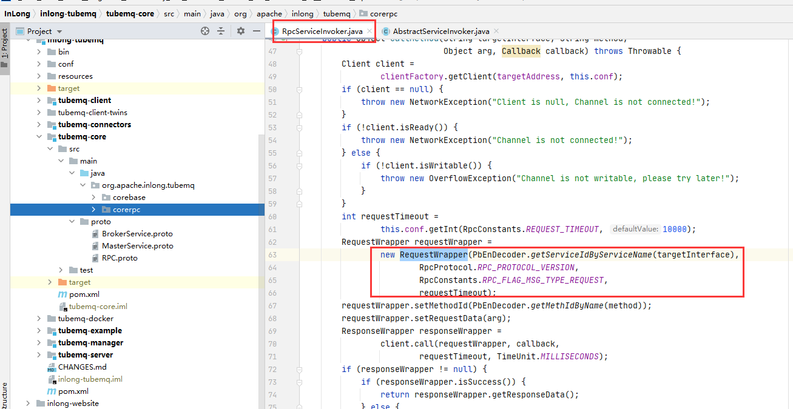

## 3 客户端的PB请求响应交互图：

### 3.1 Producer交互图：

Producer在系统中一共4对指令，到master是要做注册，心跳，退出操作；到broker只有发送消息：

从这里我们可以看到，Producer实现逻辑就是从Master侧获取指定Topic对应的分区列表等元数据信息，获得这些信息后按照客户端的规则选择分区并把消息发送给对应的Broker，而到Broker的发送是直接进行TCP连接方式进行。有同学会疑惑这样是否不安全，不注册直接发消息方式，最初考虑是内部使用尽可能的接纳消息，后来考虑安全问题，我们在这个基础上增加了授权信息携带，在服务端进行认证和授权检查，解决客户端绕开Master直连以及无授权乱发消息的情况，但这种只会在严格环境开启。生产端这块 **多语言实现的时候需要注意：**

1. 我们Master是主备实时热切换方式运行，切换时候是通过RspExceptionBody携带的信息，这个时候，需要按照字符串查找方式检索关键字&quot;StandbyException&quot;，如果异常是这类异常，要主动切换到其他的Master节点上进行重注册；这块有相关issue计划调整该问题；

2. 生产过程中遇到Master连接失败时，比如超时，链接被动断开等，Producer要进行重注册；

3. Producer要注意提前做到Broker的预连接操作：后端集群的Broker节点可达上百台，再叠加每个Broker有十个左右的分区，关于分区记录就会存在上千条可能，SDK从Master收到元数据信息后，要提前对暂未建链的Broker进行连接建立操作；

4. Producer到Broker的连接要注意异常检测，长期运行场景，要能检测出Broker坏点，以及长期不发消息，要将到Broker的连接回收，避免运行不稳定。

### 3.2 Consumer交互图：

Consumer一共7对指令，到master是要做注册，心跳，退出操作；到broker包括注册，注销，心跳，拉取消息，确认消息4对，其中到Broker的注册注销是同一个命令，用了不同的状态码表示：

从上图我们可以看到，Consumer首先要注册到Master，但注册到Master时并没有立即获取到元数据信息，原因是TubeMQ是采用的是服务器端负载均衡模式，客户端需要等待服务器派发消费分区信息；Consumer到Broker需要进行注册注销操作，原因在于消费时候分区是独占消费，即同一时刻同一分区者只能被同组的一个消费者进行消费，为了解决这个问题，需要客户端进行注册，获得分区的消费权限；消息拉取与消费确认需要成对出现，虽然协议支持多次拉取然后最后一次确认处理，但从客户端可能超时丢失分区的消费权限，从而导致数据回滚重复消费触发，数据积攒的越多重复消费的量就越多，所以按照1：1的提交比较合适。

## 4 客户端功能集合：

| **特性** | **Java** | **C/C++** | **Go** | **Python** | **Rust** | **备注** |
| --- | --- | --- | --- | --- | --- | --- |
| TLS | ✅ | | | | | |
| 认证授权 | ✅ | | | | | |
| 防绕Master生产消费 | ✅ | | | | | |
| 分布式系统里放置客户端不经过Master的认证授权即访问Broker | ✅ | | | | | |
| Effectively-Once | ✅ | | | | | |
| 精确指定分区Offset消费 | ✅ | | | | | |
| 单个组消费多个Topic消费 | ✅ | | | | | |
| 服务器过滤消费 | ✅ | | | | | |
| 生产节点坏点自动屏蔽 | ✅ | | | | | | 
| 通过算法检测坏点，自动屏蔽故障Broker的数据发送 | ✅ | | | | | | 
| 断链自动重连 | ✅ | | | | | |
| 空闲连接自动回收 | ✅ | | | | | |
| 超过指定分钟不活跃，主要是生产端，比如3分钟 | ✅ | | | | | | 
| 连接复用 | ✅ | | | | | |
| 连接按照sessionFactory共用或者不共用 | ✅ | | | | | | 
| 非连接复用 | ✅ | | | | | | 
| 异步生产 | ✅ | | | | | |
| 同步生产 | ✅ | | | | | |
| Pull消费 | ✅ | | | | | |
| Push消费 | ✅ | | | | | |
| 消费限流 | ✅ | | | | | |
| 控制单位时间消费者消费的数据量 | ✅ | | | | | |
| 消费拉取频控 | ✅ | | | | | |
| 控制消费者拉取消息的频度 | ✅ | | | | | |

## 5 客户端功能CaseByCase实现介绍：

### 5.1 客户端与服务器端RPC交互过程：

----------

如上图示，客户端要维持已发请求消息的本地保存，直到RPC超时，或者收到响应消息，响应消息通过请求发送时生成的SerialNo关联；从服务器端收到的Broker信息，以及Topic信息，SDK要保存在本地，并根据最新的返回信息进行更新，以及定期的上报给服务器端；SDK要维持到Master或者Broker的心跳，如果发现Master反馈注册超时错误时，要进行重注册操作；SDK要基于Broker进行连接建立，同一个进程不同对象之间，要允许业务进行选择，是支持按对象建立连接，还是按照进程建立连接。

### 5.2 Producer到Master注册：

----------
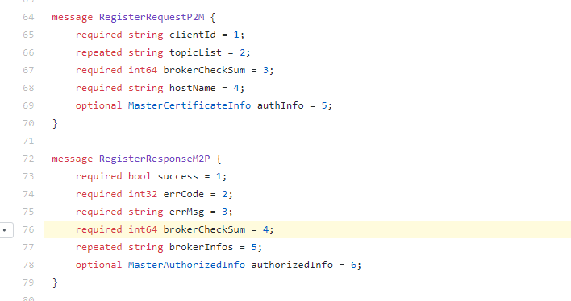

**ClientId**：Producer需要在启动时候构造一个ClientId，目前的构造规则是：

Java的SDK版本里ClientId = 节点IP地址（IPV4） + &quot;-&quot; + 进程ID + &quot;-&quot; + createTime+&quot;-&quot; +本进程内第n个实例+&quot;-&quot; +客户端版本ID 【+ &quot;-&quot; + SDK实现语言】，建议其他语言增加如上标记，以便于问题排查。该ID值在Producer生命周期内有效；

**TopicList**：是用户发布的Topic列表，Producer在初始化时候会提供初始的待发布数据的Topic列表，在运行中也允许业务通过publish函数延迟的增加新的Topic，但不支持运行中减少topic；

**brokerCheckSum**：客户端本地保存的Broker元数据信息的校验值，初始启动时候Producer本地是没有该数据的，取-1值；SDK需要在每次请求时把上次的brokerCheckSum值携带上，Master通过比较该值来确定客户端的元数据是否需要更新；

**hostname**：Producer所在机器的IPV4地址值；

**success**:操作是否成功，成功为true，失败为false；

**errCode**：如果失败，错误码时多少，目前错误码是大类错误码，具体错误原因需要由errMsg具体判明；

**errMsg**：具体的错误信息，如果出错，SDK需要把具体错误信息打出来

**authInfo**：认证授权信息，如果用户配置里填写了启动认证处理，则进行填写；如果是要求认证，则按照用户名及密码的签名进行上报，如果是运行中，比如心跳时，如果Master强制认证处理，则按照用户名及密码签名上报，没有的话则根据之前交互时Master提供的授权Token进行认证；该授权Token在生产时候也用于到Broker的消息生产时携带。

**brokerInfos**：Broker元数据信息，该字段里主要是Master反馈给Producer的整个集群的Broker信息列表；其格式如下：

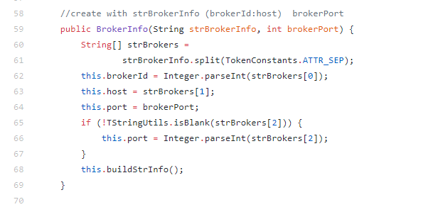

**authorizedInfo**：Master提供的授权信息，格式如下：

**visitAuthorizedToken**：防客户端绕开Master的访问授权Token，如果有该数据，SDK要保存本地，并且在后续访问Broker时携带该信息；如果后续心跳时该字段有变更，则需要更新本地缓存的该字段数据；

**authAuthorizedToken**：认证通过的授权Token，如果有该字段数据，要保存，并且在后续访问Master及Broker时携带该字段信息；如果后续心跳时该字段有变更，则需要更新本地缓存的该字段数据；

### 5.3 Producer到Master保持心跳:

----------

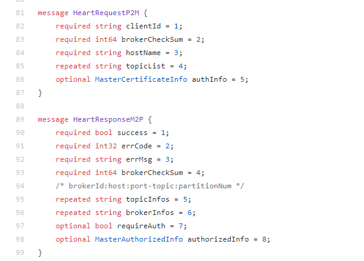

**topicInfos**：SDK发布的Topic对应的元数据信息，包括分区信息以及所在的Broker，具体解码方式如下，由于元数据非常的多，如果将对象数据原样透传所产生的出流量会非常的大，所以我们通过编码方式做了改进：

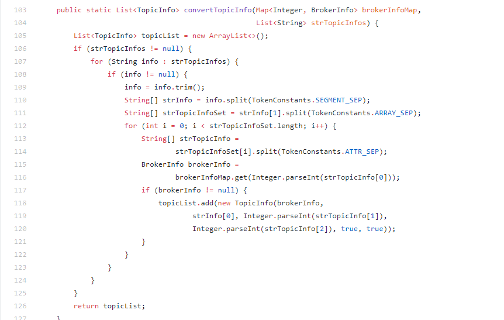

**requireAuth**：标识Master之前的授权访问码（authAuthorizedToken）过期，要求SDK下一次请求，进行用户名及密码的签名信息上报；

### 5.4 Producer到Master关闭退出:

----------

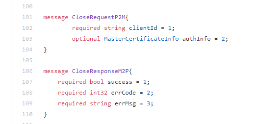

需要注意的是，如果认证开启，关闭会做认证，以避免外部干扰操作。

### 5.5 Producer到Broker发送消息:

----------

该部分的内容主要和Message的定义由关联，其中

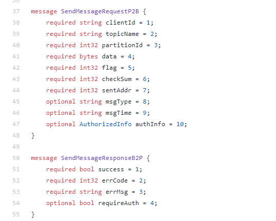

**Data**是Message的二进制字节流：

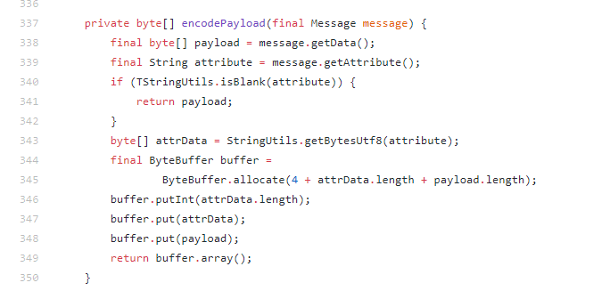

**sentAddr**是SDK所在的本机IPv4地址转成32位的数字ID；

**msgType**是过滤的消息类型，msgTime是SDK发消息时的消息时间，其值来源于构造Message时通过putSystemHeader填写的值，在Message里有对应的API获取;

**requireAuth**：到Broker进行数据生产的要求认证操作，考虑性能问题，目前未生效，发送消息里填写的authAuthorizedToken值以Master侧提供的值为准，并且随Master侧改变而改变。

### 5.6 分区负载均衡过程:

----------

Apache InLong TubeMQ模块目前采用的是服务器端负载均衡模式，均衡过程由服务器管理维护；后续版本会增加客户端负载均衡模式，形成2种模式共存的情况，由业务根据需要选择不同的均衡方式。

**服务器端负载均衡过程如下**：

- Master进程启动后，会启动负载均衡线程balancerChore，balancerChore定时检查当前已注册的消费组，进行负载均衡处理。过程简单来说就是将消费组订阅的分区均匀的分配给已注册的客户端，并定期检测客户端当前分区数是否超过预定的数量，如果超过则将多余的分区拆分给其他数量少的客户端。具体过程：首先Master检查当前消费组是否需要做负载均衡，如果需要，则将消费组订阅的topic集合的所有分区，以及这个消费组的所有消费者ID进行排序，然后按照消费组的所有分区数以及客户端个数进行整除及取模，获得每个客户端至多订阅的分区数；然后给每个客户端分配分区，并在消费者订阅时将分区信息在心跳响应里携带；如果客户端当前已有的分区有多，则给该客户端一条分区释放指令，将该分区从该消费者这里进行分区释放，同时给被分配的消费者一条分区分配的指令，告知分区分配给了对应客户端，具体指令如下：

**rebalanceId**：是一个自增ID的long数值，表示负载均衡的轮次；

**opType**：为操作码，值在EventType中定义，目前已实现的操作码只有如下4个部分：释放连接，建立连接；only\_xxx目前没有扩展开，收到心跳里携带的负载均衡信息后，Consumer根据这个值做对应的业务操作；

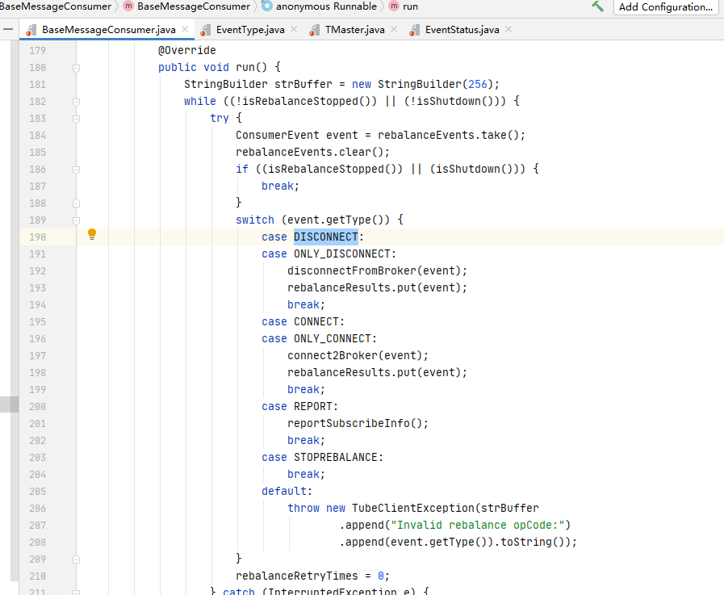

**status**：表示该事件状态，在EventStatus里定义。Master构造好负载均衡处理任务时设置指令时状态为TODO；客户端心跳请求过来时，master将该任务写到响应消息里，设置该指令状态为PROCESSING；客户端从心跳响应里收到负载均衡指令，进行实际的连接或者断链操作，操作结束后，设置指令状态为DONE，并等待下一次心跳请求发出时反馈给Master；

**subscribeInfo**表示分配的分区信息，格式如注释提示。

- 消费端操作：消费端收到Master返回的元数据信息后，就进行连接建立和释放操作，见上面opType的注解，在连接建立好后，返回事件的处理结果给到Master，从而完成相关的收到任务，执行任务，以及返回任务处理结果的操作；需要注意的是，负载均衡的注册是尽力而为的操作，如果消费端发起连接操作，但之前占用分区的消费者还没有来得及退出时，会收到PARTITION\_OCCUPIED的错误响应，这个时候就将该分区从尝试队列删除；而之前分区消费者在收到对应响应后仍会做删除操作，从而下一轮的负载均衡时分配到这个分区的消费者成功注册到分区上。

---
<a href="#top">Back to top</a>
