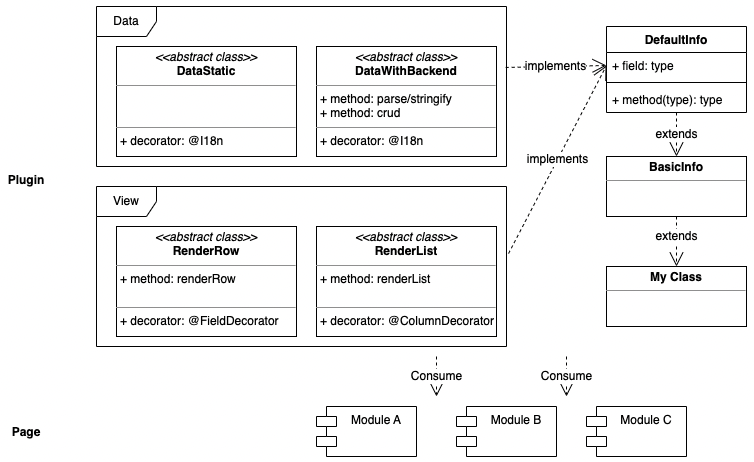

## 总览

本文面向 InLong Dashboard 插件开发人员，尝试尽可能全面地阐述开发一个 Dashboard 插件所经过的历程，帮助开发者快速新增一个 Plugin，让插件开发变得简单。
InLong Dashboard 本身作为前端控制台，采用 React 框架构建。

## 插件基础

### 设计概要

这是 InLong Dashboard 插件的设计概要图，我们将插件作为一个单独的层级，由各个页面使用不同的插件，进行消费。Data 与 View 是系统提供的抽象类，而插件就是一个个的派生类。



### 目录结构

```sh
|
|- defaults: InLong 社区提供的默认公共插件
|- extends: 私有化部署时的扩展插件，作为内部插件，不投放到社区
|- common: 插件的公共设计，例如 `BasicInfo` 的设计
```

### 插件数据类

我们提供两种基本数据类，每一个插件都只能实现其中的一种，从而实现数据模型。同时，在基本数据类中，均提供一个 `@I18n`，可用于描述字段。

- DataStatic 静态数据类
- DataWithBackend 与后台通信的数据类

### 插件视图类

在视图上，我们提供两种基本视图类，每一个插件可实现其中的一种或多种，从而实现视图模型。

- RenderRow，在该类中提供 `@FieldDecorator` 用于描述行数据视图
- RenderList，在该类中提供 `@ColumnDecorator` 用于描述列数据视图

### 基本示例

下面是一个基本示例，在该插件中，实现了与 backend 通信的一个类，包含3个字段(username, password, format)。其中，`BasicInfo` 来源于各自不同的基础类型类。

```ts
import { DataWithBackend } from '@/metas/DataWithBackend';
import { RenderRow } from '@/metas/RenderRow';
import { RenderList } from '@/metas/RenderList';
import { BasicInfo } from '../common/BasicInfo';

const { I18n } = DataWithBackend;
const { FieldDecorator } = RenderRow;
const { ColumnDecorator } = RenderList;

export default class Example extends BasicInfo implements DataWithBackend, RenderRow, RenderList {
  @FieldDecorator({
    type: 'input',
    rules: [{ required: true }],
  })
  @I18n('meta.Sinks.Username')
  username: string;

  @FieldDecorator({
    type: 'password',
    rules: [{ required: true }],
  })
  @I18n('meta.Sinks.Password')
  password: string;

  @FieldDecorator({
    type: 'radio',
    initialValue: 'TextFile',
    rules: [{ required: true }],
    props: {
      options: [
        {
          label: 'TextFile',
          value: 'TextFile',
        },
        {
          label: 'SequenceFile',
          value: 'SequenceFile',
        },
      ],
    },
  })
  @I18n('meta.Sinks.Example.Format')
  format: string;
}
```

## 扩展 ExtractNode

在 `inlong-dashboard/src/metas/sources/defaults` 目录下，新建一个 `Example.ts` 文件，作为我们新建的一个插件，同时在当前目录的 `index.ts` 文件内部进行导出（可参考已有的写法），这样便完成了新增一种名为 `Example` 的 ExtractNode。

## 扩展 LoadNode

在 `inlong-dashboard/src/metas/sinks/defaults` 目录下，新建一个 `Example.ts` 文件，作为我们新建的一个插件，同时在当前目录的 `index.ts` 文件内部进行导出（可参考已有的写法），这样便完成了新增一种名为 `Example` 的 LoadNode。
