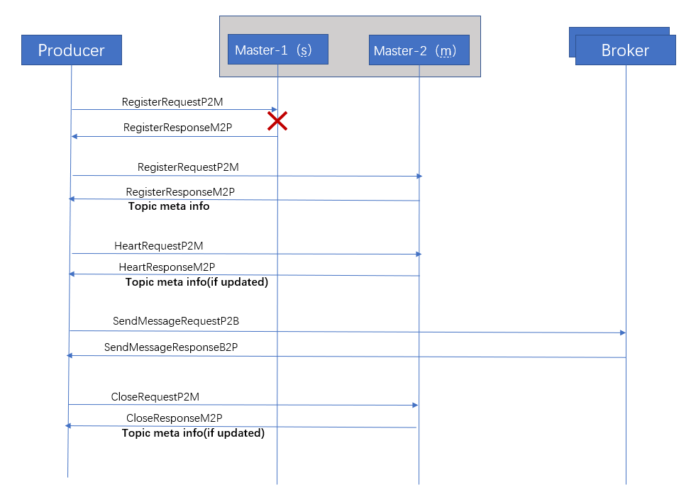
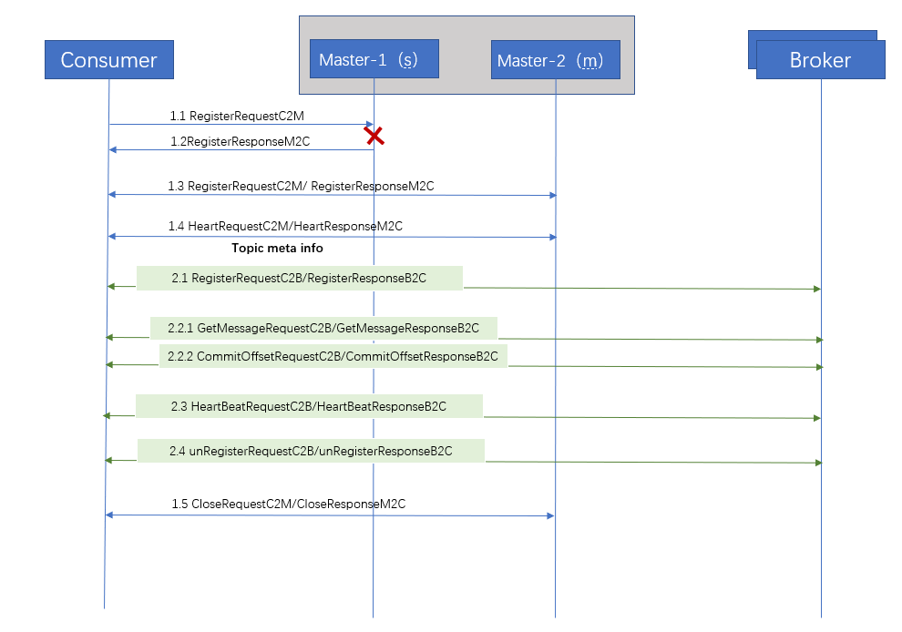
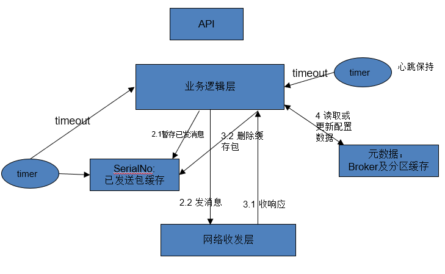

## 1 总体介绍：

Apache InLong TubeMQ 模块的各个节点间（Client、Master、Broker）通过 TCP 协议长连接交互，其消息采用的是 【二进制 + Protobuf 编码】组合方式进行定义。


在 TCP 里我们看到的都是二进制流，包括:
- msgToken： 消息头字段 `RPC_PROTOCOL_BEGIN_TOKEN`，4 字节，用来区分每一条消息以及识别对端的合法性，如果客户端收到的响应消息不是以该字段开始，说明连接方非本系统支持的协议，或者返回数据出现了异常，这个时候需要关闭该连接，提示错误退出或者重连
- serialNo：消息序列号，4 字节，主要用于客户端关联请求响应的上下文，由请求方生成，通过请求消息携带给服务端，服务器端完成该请求消息服务后通过请求消息的对应响应消息原样返回
- listSize：4 字节，表示接下来按照 PB 编码的数据块个数，目前协议定义下该字段不为0
- `[<len><data>]`： 是 2 个字段组合，表示这个数据块长度及数据内容
  - len：即数据块长度
  - data：数据

> 为什么会以 `listSize [<len><data>]` 形式定义 Protobuf(下文简称 PB)数据内容？
>
> 因为在 TubeMQ 的实现中，序列化后的 PB 数据是通过 ByteBuffer 对象保存的，Java里 ByteBuffer 存在一个最大块长 8196，超过单个块长度的 PB 消息内容就需要用多个ByteBuffer 保存，序列化到 TCP 消息时候，没有统计总长，直接按照 PB 序列化的 ByteBuffer 列表写入到了消息中。 
> 
> **在多语言实现时候，这块需要特别注意：** 需要将 PB 数据内容序列化成块数组（PB 编解码里有对应支持）。

客户端 RPC 对应的实现在 `org.apache.inlong.tubemq.corerpc` 模块下。
## 2 PB格式编码：

PB 协议分为三个部分：
- RPC 框架定义：`RPC.proto`
- Master 相关的消息编码：`MasterService.proto`
- Broker 相关的消息编码：`BrokerService.proto`

可以通过 PB 直接编译得到对应的实现类。


RPC.proto定义了 6 个结构，分为 2 种类型：
- 请求消息
- 响应消息，包括正常的响应返回以及抛异常情况下的响应返回

请求消息编码及响应消息解码可以参考 `NettyClient.java` 类实现，这个部分的定义存在一些改进空间，具体见 [TUBEMQ-109](https://issues.apache.org/jira/browse/TUBEMQ-109)，但由于兼容性考虑，会逐步的替换，按照当前 proto 版本实现至少在 1.0.0 版本前交互不是问题，但 1.0.0 时会考虑用新协议，协议实现模块需要各个 SDK 预留出改进空间。

以请求消息填写为例，RpcConnHeader等相关结构如下：

```protobuf
message RpcConnHeader {
    required int32 flag = 1;
    optional int64 traceId = 2;
    optional int64 spanId = 3;
    optional int64 parentId = 4;
}

message RequestHeader {
    optional int32 serviceType = 1;
    optional int32 protocolVer = 2;
}

message RequestBody {
    required int32 method = 1;
    optional int64 timeout = 2;
    optional bytes request = 3;
}
```

`RpcConnHeader` 的 `flag` 标记的是否请求消息，后面 3 个字段标记的是消息跟踪的相关内容，目前没有使用；

`RequestHeader` 包含了服务类型，协议版本相关信息；

`RequestBody` 则包含了请求方法，超时时间，请求内容； 其中 `timeout` 是一个请求被服务器收到到实际处理时的最大允许等待时间长，超过就丢弃，目前缺省为10秒。 请求填写具体见如下部分：
```java
RequestWrapper requestWrapper =
                new RequestWrapper(PbEnDecoder.getServiceIdByServiceName(targetInterface),
                        RpcProtocol.RPC_PROTOCOL_VERSION,
                        RpcConstants.RPC_FLAG_MSG_TYPE_REQUEST,
                        requestTimeout); // 请求超时时间
```


## 3 客户端的PB请求响应交互图：

### 3.1 Producer交互图：

Producer 在系统中一共 4 对指令，到 master 是要做注册，心跳，退出操作；到 broker 只有发送消息：


从这里我们可以看到，Producer 实现逻辑就是从 Master 侧获取指定 Topic 对应的分区列表等元数据信息，获得这些信息后按照客户端的规则选择分区并把消息发送给对应的 Broker。

Producer 的 **多语言实现的时候需要注意：**
- Master 是有主备节点的，只有主节点可以提供服务，当 producer 链接到备节点时，会得到 `StandbyException`， 此时需要链接到其他的 Master 节点，直到链接到主节点为止；

- 生产过程中遇到 Master 连接失败时，比如超时，链接被动断开等，Producer 要进行重注册；

- Producer 要注意提前做到 Broker 的预连接操作：后端集群的 Broker 节点可达上百台，再叠加每个 Broker 有十个左右的分区，关于分区记录就会存在上千条可能，SDK 从 Master 收到元数据信息后，要提前对暂未建链的 Broker 进行连接建立操作；

- Producer 到 Broker 的连接要注意异常检测，长期运行场景，要能检测出 Broker 故障节点，并且对于长期不发消息的链接，要将其回收，避免运行不稳定。


### 3.2 Consumer交互图：

Consumer 一共 7 对指令，到 master 是要做注册，心跳，退出操作；到 broker 包括注册，注销，心跳，拉取消息，确认消息 4 对，其中到 Broker 的注册注销是同一个命令，用了不同的状态码表示：


从上图我们可以看到，Consumer 首先要注册到 Master，但注册到 Master 时并没有立即获取到元数据信息，原因是 TubeMQ 是采用的是服务器端负载均衡模式，客户端需要等待服务器派发消费分区信息；Consumer到Broker需要进行注册注销操作，原因在于消费时候分区是独占消费，即同一时刻同一分区者只能被同组的一个消费者进行消费，为了解决这个问题，需要客户端进行注册，获得分区的消费权限；消息拉取与消费确认需要成对出现，虽然协议支持多次拉取然后最后一次确认处理，但从客户端可能超时丢失分区的消费权限，从而导致数据回滚重复消费触发，数据积攒的越多重复消费的量就越多，所以按照 1：1 的提交比较合适。

## 4 客户端功能集合：

| **特性**                                | **Java** | **C/C++** | **Go** | **Python** | **Rust** | **备注** |
|---------------------------------------| --- | --- | --- | --- | --- | --- |
| TLS                                   | ✅ | | | | | |
| 认证授权                                  | ✅ | | | | | |
| 防绕 Master 生产消费                        | ✅ | | | | | |
| 分布式系统里放置客户端不经过 Maste r的认证授权即访问 Broker | ✅ | | | | | |
| Effectively-Once                      | ✅ | | | | | |
| 精确指定分区 Offset 消费                      | ✅ | | | | | |
| 单个组消费多个 Topic 消费                      | ✅ | | | | | |
| 服务器过滤消费                               | ✅ | | | | | |
| 生产节点坏点自动屏蔽                            | ✅ | | | | | | 
| 通过算法检测坏点，自动屏蔽故障 Broker 的数据发送          | ✅ | | | | | | 
| 断链自动重连                                | ✅ | | | | | |
| 空闲连接自动回收                              | ✅ | | | | | |
| 超过指定分钟不活跃，主要是生产端，比如 3 分钟              | ✅ | | | | | | 
| 连接复用                                  | ✅ | | | | | |
| 连接按照 sessionFactory 共用或者不共用           | ✅ | | | | | | 
| 非连接复用                                 | ✅ | | | | | | 
| 异步生产                                  | ✅ | | | | | |
| 同步生产                                  | ✅ | | | | | |
| Pull 消费                               | ✅ | | | | | |
| Push 消费                               | ✅ | | | | | |
| 消费限流                                  | ✅ | | | | | |
| 控制单位时间消费者消费的数据量                       | ✅ | | | | | |
| 消费拉取频控                                | ✅ | | | | | |
| 控制消费者拉取消息的频度                          | ✅ | | | | | |


## 5 客户端功能 CaseByCase 实现介绍：

### 5.1 客户端与服务器端 RPC 交互过程：

----------



如上图示，客户端要维持已发请求消息的本地保存，直到RPC超时，或者收到响应消息，响应消息通过请求发送时生成的SerialNo关联；从服务器端收到的Broker信息，以及Topic信息，SDK要保存在本地，并根据最新的返回信息进行更新，以及定期的上报给服务器端；SDK要维持到Master或者Broker的心跳，如果发现Master反馈注册超时错误时，要进行重注册操作；SDK要基于Broker进行连接建立，同一个进程不同对象之间，要允许业务进行选择，是支持按对象建立连接，还是按照进程建立连接。

### 5.2 Producer 到 Master 注册：

----------
```protobuf
message RegisterRequestP2M {
    required string clientId = 1;
    repeated string topicList = 2;
    required int64 brokerCheckSum = 3;
    required string hostName = 4;
    optional MasterCertificateInfo authInfo = 5;
    optional string jdkVersion = 6;
    optional ApprovedClientConfig appdConfig = 7;
}

message RegisterResponseM2P {
    required bool success = 1;
    required int32 errCode = 2;
    required string errMsg = 3;
    required int64 brokerCheckSum = 4;
    repeated string brokerInfos = 5;
    optional MasterAuthorizedInfo authorizedInfo = 6;
    optional ApprovedClientConfig appdConfig = 7;
}
```

**ClientId**：Producer 需要在启动时候构造一个 ClientId，目前的构造规则是：

Java的SDK 版本里 
```java
ClientId = consumerGroup + "_"
        + AddressUtils.getLocalAddress() + "_" // 本机IP (IPV4)
        + pid + "_" // 进程ID
        + timestamp + "_" // 时间戳
        + counter + "_" // 自增计数器
        + consumerType + "_" // 消费者类型，包含 Pull 和 Push 两种类型
        + clientVersion; // 客户端版本号
```
建议其他语言增加如上标记，以便于问题排查。该ID值在Producer生命周期内有效；

**TopicList**：是用户发布的 Topic 列表，Producer 在初始化时候会提供初始的待发布数据的 Topic 列表，在运行中也允许业务通过 publish 函数延迟的增加新的 Topic ，但不支持运行中减少 topic；

**brokerCheckSum**：客户端本地保存的 Broker 元数据信息的校验值，初始启动时候 Producer 本地是没有该数据的，取 -1 值；SDK 需要在每次请求时把上次的 brokerCheckSum 值携带上，Master 通过比较该值来确定客户端的元数据是否需要更新；

**hostname**：Producer 所在机器的 IPV4 地址值；

**success**:操作是否成功，成功为 true，失败为 false；

**errCode**：如果失败，错误码时多少，目前错误码是大类错误码，具体错误原因需要由 errMsg 具体判明；

**errMsg**：具体的错误信息，如果出错，SDK 需要把具体错误信息打出来

**authInfo**：认证授权信息，如果用户配置里填写了启动认证处理，则进行填写；如果是要求认证，则按照用户名及密码的签名进行上报，如果是运行中，比如心跳时，如果 Master 强制认证处理，则按照用户名及密码签名上报，没有的话则根据之前交互时 Master 提供的授权 Token 进行认证；该授权 Token 在生产时候也用于到 Broker 的消息生产时携带。

**brokerInfos**：Broker 元数据信息，该字段里主要是 Master 反馈给 Producer 的整个集群的 Broker 信息列表；其格式如下：

```java
public BrokerInfo(String strBrokerInfo, int brokerPort) {
        String[] strBrokers =
                strBrokerInfo.split(TokenConstants.ATTR_SEP);
        this.brokerId = Integer.parseInt(strBrokers[0]);
        this.host = strBrokers[1];
        this.port = brokerPort;
        if (!TStringUtils.isBlank(strBrokers[2])) {
            this.port = Integer.parseInt(strBrokers[2]);
        }
        this.buildStrInfo();
    }
```

**authorizedInfo**：Master 提供的授权信息，格式如下：

```protobuf
message MasterAuthorizedInfo {
    required int64 visitAuthorizedToken = 1;
    optional string authAuthorizedToken = 2;
}
```

**visitAuthorizedToken**：防客户端绕开 Master 的访问授权 Token，如果有该数据，SDK 要保存本地，并且在后续访问 Broker 时携带该信息；如果后续心跳时该字段有变更，则需要更新本地缓存的该字段数据；

**authAuthorizedToken**：认证通过的授权 Token，如果有该字段数据，要保存，并且在后续访问 Master 及 Broker 时携带该字段信息；如果后续心跳时该字段有变更，则需要更新本地缓存的该字段数据；


### 5.3 Producer 到 Master 保持心跳:

----------

```protobuf
message HeartRequestP2M {
    required string clientId = 1;
    required int64 brokerCheckSum = 2;
    required string hostName = 3;
    repeated string topicList = 4;
    optional MasterCertificateInfo authInfo = 5;
    optional ApprovedClientConfig appdConfig = 6;
}

message HeartResponseM2P {
    required bool success = 1;
    required int32 errCode = 2;
    required string errMsg = 3;
    required int64 brokerCheckSum = 4;
    /* brokerId:host:port-topic:partitionNum */
    repeated string topicInfos = 5;
    repeated string brokerInfos = 6;
    optional bool requireAuth = 7;
    optional MasterAuthorizedInfo authorizedInfo = 8;
    optional ApprovedClientConfig appdConfig = 9;
}
```

**topicInfos**：SDK 发布的 Topic 对应的元数据信息，包括分区信息以及所在的 tBroker，具体解码方式如下，由于元数据非常的多，如果将对象数据原样透传所产生的出流量会非常的大，所以我们通过编码方式做了改进：

```java
public static Tuple2<Map<String, Integer>, List<TopicInfo>> convertTopicInfo(
            Map<Integer, BrokerInfo> brokerInfoMap, List<String> strTopicInfos) {
        List<TopicInfo> topicList = new ArrayList<>();
        Map<String, Integer> topicMaxSizeInBMap = new ConcurrentHashMap<>();
        if (strTopicInfos == null || strTopicInfos.isEmpty()) {
            return new Tuple2<>(topicMaxSizeInBMap, topicList);
        }
        String[] strInfo;
        String[] strTopicInfoSet;
        String[] strTopicInfo;
        BrokerInfo brokerInfo;
        for (String info : strTopicInfos) {
            if (info == null || info.isEmpty()) {
                continue;
            }
            info = info.trim();
            strInfo = info.split(TokenConstants.SEGMENT_SEP, -1);
            strTopicInfoSet = strInfo[1].split(TokenConstants.ARRAY_SEP);
            for (String s : strTopicInfoSet) {
                strTopicInfo = s.split(TokenConstants.ATTR_SEP);
                brokerInfo = brokerInfoMap.get(Integer.parseInt(strTopicInfo[0]));
                if (brokerInfo != null) {
                    topicList.add(new TopicInfo(brokerInfo,
                            strInfo[0], Integer.parseInt(strTopicInfo[1]),
                            Integer.parseInt(strTopicInfo[2]), true, true));
                }
            }
            if (strInfo.length == 2 || TStringUtils.isEmpty(strInfo[2])) {
                continue;
            }
            try {
                topicMaxSizeInBMap.put(strInfo[0], Integer.parseInt(strInfo[2]));
            } catch (Throwable e) {
                //
            }
        }
        return new Tuple2<>(topicMaxSizeInBMap, topicList);
    }
```

**requireAuth**：标识Master之前的授权访问码（authAuthorizedToken）过期，要求SDK下一次请求，进行用户名及密码的签名信息上报；

### 5.4 Producer 到 Master 关闭退出:

----------

```protobuf
message CloseRequestP2M{
	required string clientId = 1;
	optional MasterCertificateInfo authInfo = 2;
}

message CloseResponseM2P{
    required bool success = 1;
    required int32 errCode = 2;
    required string errMsg = 3;
}
```

需要注意的是，如果认证开启，关闭会做认证，以避免外部干扰操作。

### 5.5 Producer 到 Broker 发送消息:

----------

该部分的内容主要和 Message 的定义有关联，其中

```protobuf
message SendMessageRequestP2B {
    required string clientId = 1;
    required string topicName = 2;
    required int32 partitionId = 3;
    required bytes data = 4;
    required int32 flag = 5;
    required int32 checkSum = 6;
    required int32 sentAddr = 7;
    optional string msgType = 8;
    optional string msgTime = 9;
    optional AuthorizedInfo authInfo = 10;
}

message SendMessageResponseB2P {
    required bool success = 1;
    required int32 errCode = 2;
    required string errMsg = 3;
    optional bool requireAuth = 4;
    optional int64 messageId = 5;
    optional int64 appendTime = 6;
    optional int64 appendOffset = 7;
}
```

**Data**是 Message 的二进制字节流：

```java
private byte[] encodePayload(final Message message) {
        final byte[] payload = message.getData();
        final String attribute = message.getAttribute();
        if (TStringUtils.isBlank(attribute)) {
            return payload;
        }
        byte[] attrData = StringUtils.getBytesUtf8(attribute);
        final ByteBuffer buffer =
                ByteBuffer.allocate(4 + attrData.length + payload.length);
        buffer.putInt(attrData.length);
        buffer.put(attrData);
        buffer.put(payload);
        return buffer.array();
    }
```

**sentAddr**是 SDK 所在的本机 IPv4 地址转成 32 位的数字 ID；

**msgType**是过滤的消息类型，msgTime 是 SDK 发消息时的消息时间，其值来源于构造 Message 时通过 putSystemHeader 填写的值，在 Message 里有对应的 API 获取;

**requireAuth**：到 Broker 进行数据生产的要求认证操作，考虑性能问题，目前未生效，发送消息里填写的 authAuthorizedToken 值以 Master 侧提供的值为准，并且随 Master 侧改变而改变。

### 5.6 分区负载均衡过程:

----------

Apache InLong TubeMQ 模块目前采用的是服务器端负载均衡模式，均衡过程由服务器管理维护；后续版本会增加客户端负载均衡模式，形成 2 种模式共存的情况，由业务根据需要选择不同的均衡方式。

**服务器端负载均衡过程如下**：

- Master进程启动后，会启动负载均衡线程 balancerChore，balancerChore 定时检查当前已注册的消费组，进行负载均衡处理。过程简单来说就是将消费组订阅的分区均匀的分配给已注册的客户端，并定期检测客户端当前分区数是否超过预定的数量，如果超过则将多余的分区拆分给其他数量少的客户端。具体过程：首先 Master 检查当前消费组是否需要做负载均衡，如果需要，则将消费组订阅的 topic 集合的所有分区，以及这个消费组的所有消费者 ID 进行排序，然后按照消费组的所有分区数以及客户端个数进行整除及取模，获得每个客户端至多订阅的分区数；然后给每个客户端分配分区，并在消费者订阅时将分区信息在心跳响应里携带；如果客户端当前已有的分区有多，则给该客户端一条分区释放指令，将该分区从该消费者这里进行分区释放，同时给被分配的消费者一条分区分配的指令，告知分区分配给了对应客户端，具体指令如下：

```protobuf
message EventProto{
    optional int64 rebalanceId = 1;
    optional int32 opType = 2;
    optional int32 status = 3;
    /* consumerId@group-brokerId:host:port-topic:partitionId */
    repeated string subscribeInfo = 4;
}
```

**rebalanceId**：是一个自增 ID 的 long 数值，表示负载均衡的轮次；

**opType**：为操作码，值在 EventType 中定义，目前已实现的操作码只有如下 4 个部分：释放连接，建立连接；only\_xxx 目前没有扩展开，收到心跳里携带的负载均衡信息后，Consumer 根据这个值做对应的业务操作；

```java
switch (event.getType()) {
       case DISCONNECT:
       case ONLY_DISCONNECT:
           disconnectFromBroker(event);
           rebalanceResults.put(event);
           break;
       case CONNECT:
       case ONLY_CONNECT:
           connect2Broker(event);
           rebalanceResults.put(event);
           break;
       case REPORT:
           reportSubscribeInfo();
           break;
       case STOPREBALANCE:
           break;
       default:
           throw new TubeClientException(strBuffer
                   .append("Invalid rebalance opCode:")
                   .append(event.getType()).toString());
}
```

**status**：表示该事件状态，在 EventStatus 里定义。Master 构造好负载均衡处理任务时设置指令时状态为 TODO；客户端心跳请求过来时，master 将该任务写到响应消息里，设置该指令状态为 PROCESSING；客户端从心跳响应里收到负载均衡指令，进行实际的连接或者断链操作，操作结束后，设置指令状态为 DONE，并等待下一次心跳请求发出时反馈给 Master；

```java
public enum EventStatus {
    /**
     * To be processed state.
     * */
    TODO(0, "To be processed"),
    /**
     * On processing state.
     * */
    PROCESSING(1, "Being processed"),
    /**
     * Processed state.
     * */
    DONE(2, "Process Done"),

    /**
     * Unknown state.
     * */
    UNKNOWN(-1, "Unknown event status"),
    /**
     * Failed state.
     * */
    FAILED(-2, "Process failed");
}
```

**subscribeInfo**表示分配的分区信息，格式如注释提示。


- 消费端操作：消费端收到 Master 返回的元数据信息后，就进行连接建立和释放操作，见上面 opType 的注解，在连接建立好后，返回事件的处理结果给到 Master，从而完成相关的收到任务，执行任务，以及返回任务处理结果的操作；需要注意的是，负载均衡的注册是尽力而为的操作，如果消费端发起连接操作，但之前占用分区的消费者还没有来得及退出时，会收到 `PARTITION_OCCUPIED` 的错误响应，这个时候就将该分区从尝试队列删除；而之前分区消费者在收到对应响应后仍会做删除操作，从而下一轮的负载均衡时分配到这个分区的消费者成功注册到分区上。

---
<a href="#top">Back to top</a>
