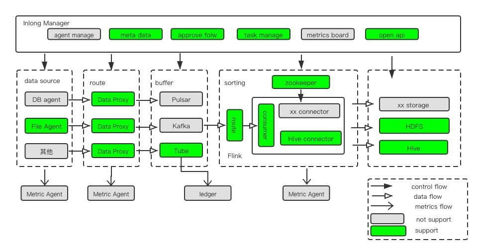
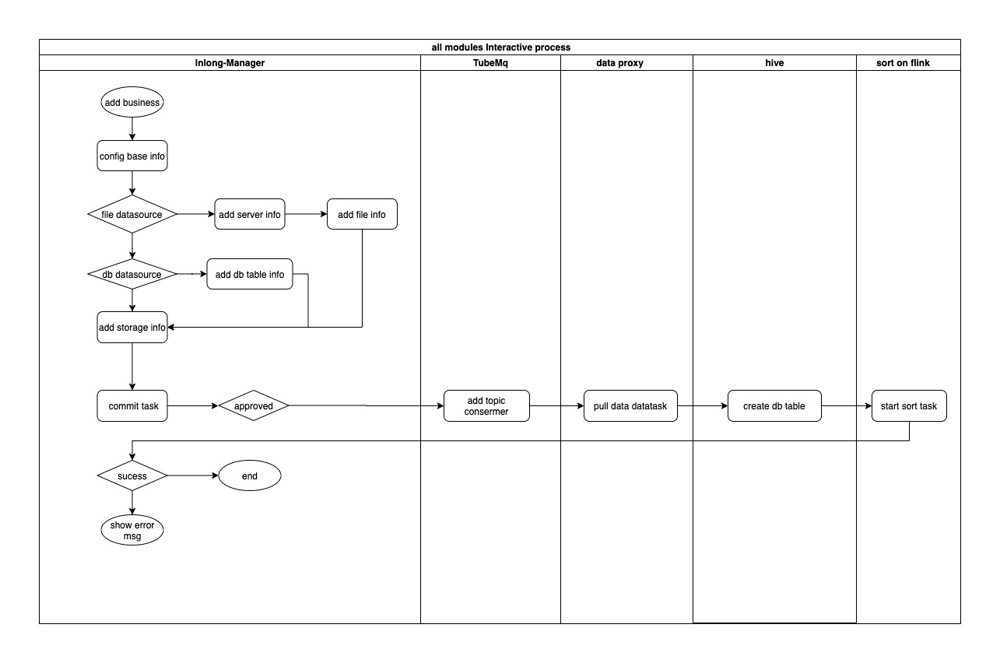

## Introduction to Apache InLong Manager

+ Target positioning: Apache inlong is positioned as a one-stop integration framework for massive data, providing complete coverage of big data access scenarios from data collection, transmission, sorting, and technical capabilities.

+ Platform value: Users can complete task configuration, management, and indicator monitoring through the platform's built-in management and configuration platform. At the same time, the platform provides SPI extension points in the main links of the process to implement custom logic as needed. Ensure stable and efficient functions while lowering the threshold for platform use.

+ Apache InLong Manager is the user-oriented unified UI of the entire data access platform. After the user logs in, it will provide different function permissions and data permissions according to the corresponding role. The page provides maintenance portals for the platform's basic clusters (such as mq, sorting), and you can view basic maintenance information and capacity planning adjustments at any time. At the same time, business users can complete the creation, modification and maintenance of data access tasks, and index viewing and reconciliation functions. The corresponding background service will interact with the underlying modules when users create and start tasks, and deliver the tasks that each module needs to perform in a reasonable way. Play the role of coordinating the execution process of the serial back-end business.
## Architecture

##Module division of labor

| Module | Responsibilities |
| :----| :---- |
| manager-common | Module common code, entry exception definition, tool class, enumeration, etc.|
| manager-dao |Database Operation |
| manager-service |Business Logic Layer |
| manager-web | Front-end interactive response interface |
| manager-workflow-engine | Workflow Engine |

## use process 

## data model
