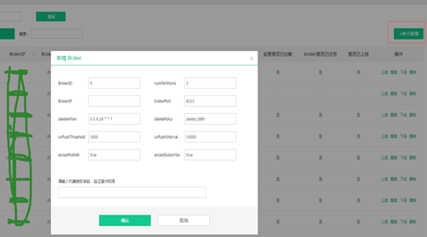
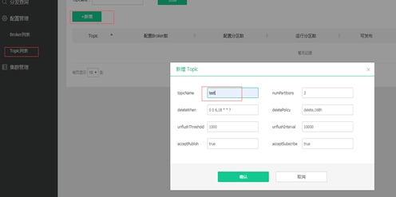
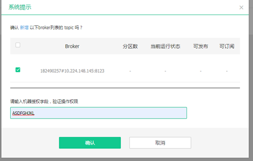
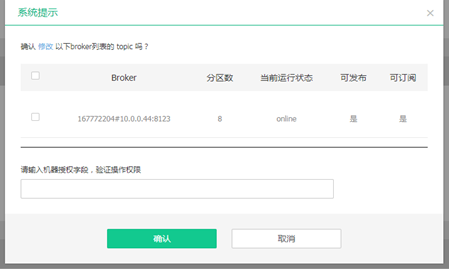
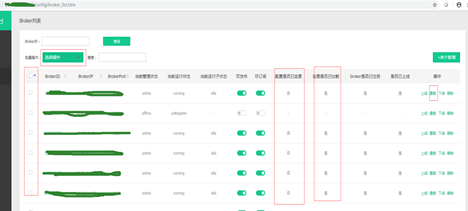

## 1 Control console relationship

The TubeMQ console is a simple operation tool for managing the TubeMQ cluster, including the Master, Broker in the cluster, and Topic metadata deployed on the Broker and other operational data and operations related to the TubeMQ system. It should be noted that the functions provided by the TubeMQ front desk currently provided do not cover the scope of functions provided by TubeMQ. You can refer to "TubeMQ HTTP Access Interface Definition.xls" to define your own management and control front desk that meets your business needs. The access address of the TubeMQ control console is http://portal:webport

Among them, the portal parameter is the IP address of any Master or backup Master in the cluster, and the webport parameter is the web port of the configured Master.

## 2 Introduction to each part of the TubeMQ console

The console has 3 parts: consumption query, configuration management, and cluster management; configuration management is divided into two parts: Broker configuration and Topic configuration. We first introduce simple consumption query and cluster management and then introduce complex configuration management.

### 2.1 Consumption Query

Click the consumption query, we will see the following list information, which is the registered consumer group information in the current TubeMQ cluster, including the specific consumer group name, the topic of consumption, and the summary information about the total number of consumer partitions in the group, as follows :

Click on the page and you can see the consumer members in the selected consumer group, and the Broker and Partition information of the corresponding consumer, as shown in the following figure:

This page can be used for us to query, enter the topic or consumer group name, you can quickly confirm which consumer groups in the system are consuming topics, and what the consumption goals of each consumer group are.

### 2.2 Cluster Management

Cluster management mainly manages the HA of the Master. On this page, we can see the current master's various nodes and node status. At the same time, we can change the active and standby status of the nodes through the "switch" operation:

### 2.3 Configuration Management

The configuration management page includes not only the management of Broker and Topic metadata but also the online release and offline operations of Broker and Topic. It has two meanings. For example, the Broker list displays the configured Broker metadata in the current cluster. , Including Broker record information that is in draft, online, and offline state:

From the page information, we can also see that in addition to Broker’s record information, there is also Broker’s management information in the cluster, including whether it is online, whether it is in command processing, whether it is readable, whether it is writable, and whether the configuration is done Change, whether the changed configuration information has been loaded.

Click the Add button, and the pop-up box will be as follows. This indicates the metadata information of the broker to be added, including BrokerID, BrokerIP, BrokerPort, and the default configuration information of the Topic deployed in the Broker. For details of the related fields, see "TubeMQ HTTP API definition.xls ":

All TubeMQ console change operations will require the input of the operation authorization code, which is defined by the operation and maintenance through the confModAuthToken field of the master configuration file master.ini: if you know the password of this cluster, you can proceed For this operation, for example, if you are an administrator, you are an authorized person, or you can log in to the master machine to get the password, you are considered to be authorized to operate this function.

## 3 Operations and precautions involved in the TubeMQ control console

As mentioned above, the TubeMQ control console operates the Tube MQ cluster. The suite is responsible for the management of TubeMQ cluster nodes such as Master and Broker, including automatic deployment and installation. Therefore, the following points need to be paid attention to:

1. **When the TubeMQ cluster is expanded or reduced, the Broker nodes must be added, online, offline, and deleted on the TubeMQ console before the corresponding Broker nodes can be added or deleted in the physical environment**:

The TubeMQ cluster manages the Broker in accordance with the state machine. As shown in the figure above, it involves [draft, online, read-only, write-only, offline] and other states. When the record increase has not yet taken effect, it is in the draft state; after confirming to go online, it is in the online state; the node to delete, first change from the online state to the offline state, and then clear the node records saved in the system through the delete operation. The states of the draft, online, and offline are to distinguish the status where each Broker node is, and the Master only distributes the brokers in the online state to the corresponding producers and consumers; read-only and write-only are the sub-states of Broker in the online state, which means that only the data on the Broker can be read or written; the relevant state and operation are shown on the page details. Add a record then you can understand the relationship.

After adding these records to the TubeMQ console, we can deploy and start the Broker node. At this time, the page of the Tube cluster environment will display the running status of the node. If it is in the unregistered state, as shown in the figure below, it means that the node registration has failed. Check the log on the corresponding broker node to confirm the reason. At present, this part is very mature, the error message will prompt the complete information, and you can directly deal with the problem according to the prompt.

2. **Topic metadata information needs to be added and deleted through the topic_list page:**

As shown in the figure below, if the business finds that the topic that it consumes is not on the TubeMQ console, it needs to operate directly on the TubeMQ console:

When we add a topic through the topic_list page in the above figure, the following box will pop up:

After clicking Confirm, there will be a list of Brokers that choose to deploy the added Topic, and confirm the operation after selecting the deployment scope:

After completing the operation of adding a topic, we also need to reload the Broker that has made configuration changes, as shown in the following figure:

The topic can only be used externally after the reload is completed. We will find that the following configuration changes have changed status after the restart is completed:

Now, we can produce and consume the topic.

## 4 Operation precautions after changing Topic metadata:

### 4.1 How to configure Topic:

After you click on any topic in the Topic list, the following box will pop up, which contains the related metadata information of the topic, which determines how many partitions the topic has set on the Broker, the current read and write states, and the frequency of data flashing. Information such as data aging cycle and time:

This information is directly defined by the system administrator after setting the default values. Generally, it will not change. If the business has special needs, such as increasing the parallelism of consumption and increasing the partition or want to reduce the frequency of flashing, how to operate? As shown in the figure below, the meaning and function of the fields on each page are as follows:

|name|must|description|type|
|---|---|---|---|
|topicName|yes| the topic name|String|
|brokerId|yes|the id of the broker, its default value is 0. If brokerId is not zero, it ignores brokerIp field|String|
|deleteWhen|no|the default deleting time of the topic data. The format should like cronjob form `0 0 6, 18 * * ?`|String|
|deletePolicy|no|the default policy for deleting, the default policy is "delete, 168"|String|
|numPartitions|no|the default partition number of a default topic on the broker. Default 1|Int|
|unflushThreshold|no|the maximum message number which allows in memory. It has to be flushed to disk if the number exceed this value. Default 1000|Int|
|numTopicStores|no|the number of data block and partition group allowed to create, default 1. If it is larger than 1, the partition number and topic number should be mapping with this value|Int|
|unflushInterval|no|the maximum interval for unflush, default 1000ms|Int|
|memCacheMsgCntInK|no|the max cached message package, default is 10, the unit is K|Int|
|memCacheMsgSizeInMB|no|the max cache message size in MB, default 3|Int|
|memCacheFlushIntvl|no|the max unflush interval in ms, default 20000|Int|
|brokerTLSPort|no|the port of TLS of the broker, it has no default value|Int|
|acceptPublish|no|whether the broker accept publish, default true|Boolean|
|acceptSubscribe|no|whether the broker accept subscribe, default true| Boolean|
|createUser|yes|the create user|String|
|createDate|yes|the create date in format `yyyyMMddHHmmss`|String|
|confModAuthToken|yes|the authorized key for configuration update|String|

For the detail please see "Tube MQ HTTP API Definition.xls", which has a very clear definition. You can make changes through the **Modify** button in the upper right corner of the page, and after confirming, the following box will pop up:

Its steps are:
- a. Select the set of Broker nodes that participate in the modification of Topic metadata;
- b. Provide the authorization information code for the modification operation.

** Special Notice: You need to note that after entering the authorization code to modify, the data change will not take effect until it is refreshed. At the same time, the effective Broker must be operated on a proportional basis. **

### 4.2 Precautions for Topic Change:

As shown above, after choosing to change Topic metadata, the previously selected Broker collection will display a yes prompt on **Configuration Has Been Changed**. We also need to reload and refresh the changes, select the Broker set, and then select the refresh operation, which can be batch or single, but it must be noted that the operation should be carried out in batches, and the current Broker running status of the previous batch of operations is running After that, the next batch of configuration refresh operations can be entered; if a node is in the online state but does not enter the running state for a long time (the default maximum is 2 minutes), you need to stop the refresh and check the cause of the problem before continuing the operation.

The reason for the batch operation is that when our system changes, the designated Broker will stop reading and writing. If all Brokers are reloaded in a unified manner, it is obvious that the entire cluster will have unreadable or unwritable services, and the access must be abnormal.
### 4.3 Dealing with the deletion of Topic:

The deletion on the page is a soft delete process. If you want to completely delete the topic, you need to perform a hard delete operation through the API interface (to avoid business misoperation).

To this end, After completing the above content, the Topic metadata is changed.

---
<a href="#top">Back to top</a>