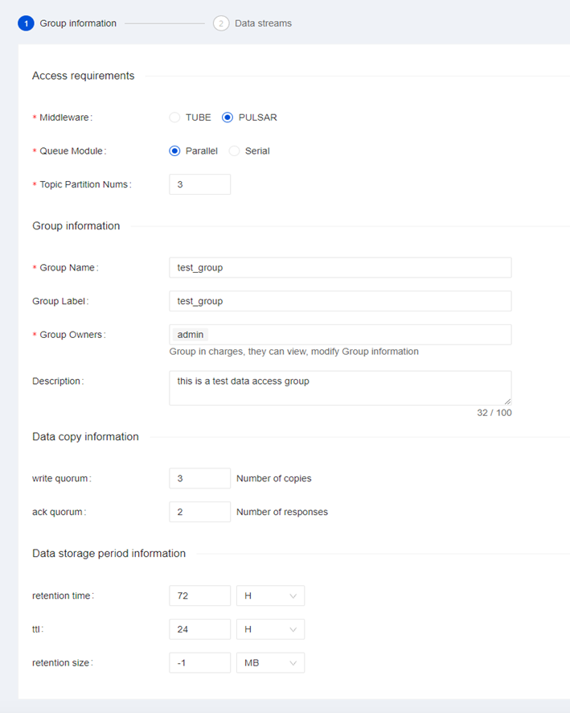

Apache InLong has increased the ability to access data through Apache Pulsar, taking full advantage of Pulsar's technical advantages that are different from other MQ, and providing complete solutions for data integration scenarios with higher data quality requirements such as finance and billing.
In the following content, we will use a complete example to introduce Apache Pulsar to access data through Apache InLong.


## Install Pulsar
Please refer to [Official Installation Guidelines](https://pulsar.apache.org/docs/en/standalone/).

## Install Hive
Hive is the necessary component. If you don't have Hive in your machine, we recommand using Docker to install it. Details can be found [here](https://github.com/big-data-europe/docker-hive).

> Note that if you use Docker, you need to add a port mapping `8020:8020`, because it's the port of HDFS DefaultFS, and we need to use it later.

## Install InLong
Before we begin, we need to install InLong. Here we provide two ways:
1. Install InLong with Docker by according to the [instructions here](deployment/docker.md).(Recommanded)
2. Install InLong binary according to the [instructions here](deployment/bare_metal.md).

Unlike InLong TubeMQ, if you use Apache Pulsar, you need to configure Pulsar cluster information 
in the Manager component installation. The format is as follows：
```
# Pulsar admin URL
pulsar.adminUrl=http://127.0.0.1:8080,127.0.0.2:8080,127.0.0.3:8080
# Pulsar broker address
pulsar.serviceUrl=pulsar://127.0.0.1:6650,127.0.0.1:6650,127.0.0.1:6650
# Default tenant of Pulsar
pulsar.defaultTenant=public
```

## Create a data ingestion
### Configure data streams group information

When creating data ingestion, the message middleware that the data stream group can use is Pulsar, 
and other configuration items related to Pulsar include:
- Queue module: Parallel or Serial, when selecting parallel, you can set the number of topic partitions
- Write quorum: Number of copies to store for each message
- Ack quorum: Number of guaranteed copies (acks to wait before write is complete)
- retention time: retention time for the consumed message
- ttl: The default Time to Live for message
- retention size: retention size for the consumed message

### Configure data stream

When configuring the message source, the file path in the file data source can be referred to [file-agent-configuration](https://inlong.apache.org/docs/next/modules/agent/file#file-agent-configuration).

### Configure data information


### Configure Hive cluster
Save Hive cluster information, click "Ok" to submit.


## Data ingestion Approval
Enter **Approval** page, click **My Approval**, abd approve the data ingestion application. After the approval is over, 
the topics and subscriptions required for the data stream will be created in the Pulsar cluster synchronously.
We can use the command-line tool in the Pulsar cluster to check whether the topic is created successfully:


## Configure the agent
Create a collect job by using `curl` to make a request.
```
curl --location --request POST 'http://localhost:8008/config/job' \
--header 'Content-Type: application/json' \
--data '{
"job": {
"dir": {
"path": "",
"pattern": "/data/collect-data/test.log"
},
"trigger": "org.apache.inlong.agent.plugin.trigger.DirectoryTrigger",
"id": 1,
"thread": {
"running": {
"core": "4"
}
},
"name": "fileAgentTest",
"source": "org.apache.inlong.agent.plugin.sources.TextFileSource",
"sink": "org.apache.inlong.agent.plugin.sinks.ProxySink",
"channel": "org.apache.inlong.agent.plugin.channel.MemoryChannel"
},
"proxy": {
"inlongGroupId": "b_test_group",
"inlongStreamId": "test_stream"
},
"op": "add"
}'
```

At this point, the agent is configured successfully.
Then we need to create a new file `./collect-data/test.log` and add content to it to trigger the agent to send data to the dataproxy.

``` shell
mkdir collect-data
END=100000
for ((i=1;i<=END;i++)); do
    sleep 3
    echo "name_$i | $i" >> ./collect-data/test.log
done
```

## Data Check
Finally, we log in to the Hive cluster and use Hive SQL commands to check 
whether data is successfully inserted in the `test_stream` table.

## Troubleshooting
If data is not correctly written to the Hive cluster, you can check whether the `DataProxy` and `Sort` related information are synchronized:
- Check whether the topic information corresponding to the data stream is correctly written in the `conf/topics.properties` folder of `InLong DataProxy`:
```
b_test_group/test_stream=persistent://public/b_test_group/test_stream
```

- Check whether the configuration information of the data stream is successfully pushed in 
- the ZooKeeper monitored by `InLong Sort`：
```
get /inlong_hive/dataflows/{{sink_id}}
```
