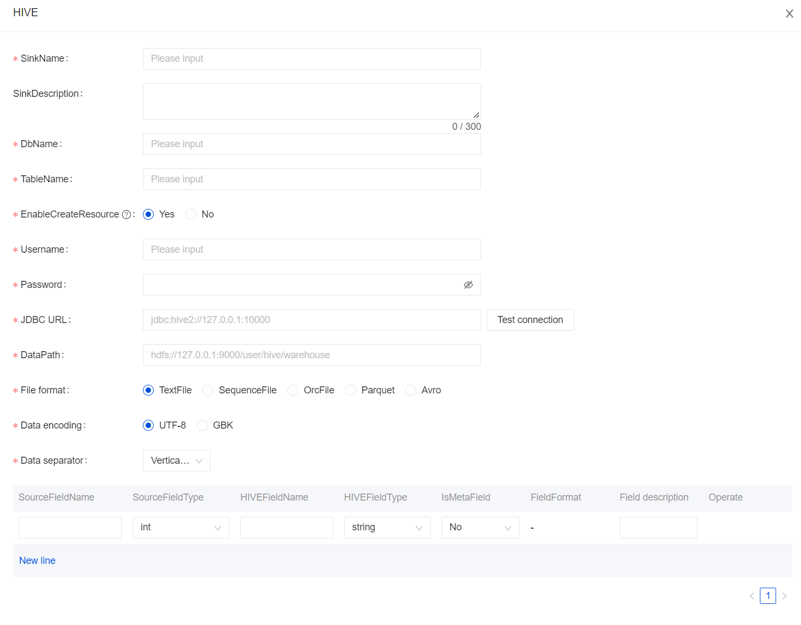

import {siteVariables} from '../../version';

## Overview
Hive Load Node can write data to hive. Using the flink dialect, the insert operation is currently supported, and the data in the upsert mode will be converted into insert.
Manipulating hive tables using the hive dialect is currently not supported.

## Supported Version

| Load Node                           | Version                                            | 
|-------------------------------------|----------------------------------------------------|
| [Hive](./hive.md) | [Hive](https://nightlies.apache.org/flink/flink-docs-master/docs/connectors/table/hive/overview/#supported-hive-versions): 1.x, 2.x, 3.x |

### Dependencies

Using Hive load requires the introduction of dependencies.
Of course, you can also use INLONG to provide jar packages.([sort-connector-hive](https://inlong.apache.org/download))

### Maven dependency

<pre><code parentName="pre">
{`<dependency>
    <groupId>org.apache.inlong</groupId>
    <artifactId>sort-connector-hive</artifactId>
    <version>${siteVariables.inLongVersion}</version>
</dependency>
`}
</code></pre>

## How to create a Hive Load Node

### Usage for SQL API

The example below shows how to create a Hive Load Node with `Flink SQL Cli` :

```sql
CREATE TABLE hiveTableName (
  id STRING,
  name STRING,
  uv BIGINT,
  pv BIGINT
) WITH (
  'connector' = 'hive',
  'default-database' = 'default',
  'hive-version' = '3.1.2',
  'hive-conf-dir' = 'hdfs://localhost:9000/user/hive/hive-site.xml'
);
```
### Usage for InLong Dashboard

#### Configuration
When creating a data stream, select `Hive` for the data stream direction, and click "Add" to configure it.



### Usage for InLong Manager Client

TODO: It will be supported in the future.

## Hive Load Node Options
<table class="table table-bordered">
    <thead>
      <tr>
        <th class="text-left" style={{width: '25%'}}>Option</th>
        <th class="text-center" style={{width: '8%'}}>Required</th>
        <th class="text-center" style={{width: '7%'}}>Default</th>
        <th class="text-center" style={{width: '10%'}}>Type</th>
        <th class="text-center" style={{width: '50%'}}>Description</th>
      </tr>
    </thead>
    <tbody>
    <tr>
        <td><h5>connector</h5></td>
        <td>required</td>
        <td style={{wordWrap: 'break-word'}}>(none)</td>
        <td>String</td>
        <td>Specify what connector to use, here should be 'hive'.</td>
    </tr>
    <tr>
      <td><h5>default-database</h5></td>
      <td>required</td>
      <td style={{wordWrap: 'break-word'}}>(none)</td>
      <td>String</td>
      <td></td>
    </tr>
    <tr>
      <td><h5>hive-conf-dir</h5></td>
      <td>required</td>
      <td style={{wordWrap: 'break-word'}}>(none)</td>
      <td>String</td>
      <td>If you don't want to upload hive-site.xml to HDFS, 
      you can put this configuration into the classpath of the project,
      and then this place only needs to be not empty, 
      otherwise you must fill in the complete HDFS URL.</td>
    </tr>
    <tr>
      <td><h5>sink.partition-commit.trigger</h5></td>
      <td>optional</td>
      <td style={{wordWrap: 'break-word'}}>(none)</td>
      <td>String</td>
      <td>If hive exists partition you can set trigger mode.(process-time)</td>
    </tr>
    <tr>
      <td><h5>partition.time-extractor.timestamp-pattern</h5></td>
      <td>optional</td>
      <td style={{wordWrap: 'break-word'}}>(none)</td>
      <td>String</td>
      <td>If hive exists partition you can set timestamp-pattern mode.(yyyy-MM-dd...)</td>
    </tr>
    <tr>
      <td><h5>sink.partition-commit.delay</h5></td>
      <td>optional</td>
      <td style={{wordWrap: 'break-word'}}>(none)</td>
      <td>String</td>
      <td>If hive exists partition you can set delay  mode.(10s,20s,1m...)</td>
    </tr>
    <tr>
      <td><h5>sink.partition-commit.policy.kind</h5></td>
      <td>optional</td>
      <td style={{wordWrap: 'break-word'}}>(none)</td>
      <td>String</td>
      <td>Policy to commit a partition is to notify the downstream application that the partition has finished writing, 
      the partition is ready to be read. metastore: add partition to metastore. 
      Only hive table supports metastore policy, file system manages partitions through directory structure.
      success-file: add '_success' file to directory. Both can be configured at the same time: 'metastore,success-file'.
      custom: use policy class to create a commit policy.
      Support to configure multiple policies: 'metastore,success-file'.</td>
    </tr>
    </tbody>
</table>

## Data Type Mapping
<div class="wy-table-responsive">
<table class="colwidths-auto docutils">
    <thead>
      <tr>
        <th class="text-left">Hive type</th>
        <th class="text-left">Flink SQL type</th>
      </tr>
    </thead>
    <tbody>
    <tr>
      <td>char(p)</td>
      <td>CHAR(p)</td>
    </tr>
    <tr>
      <td>varchar(p)</td>
      <td>VARCHAR(p)</td>
    </tr>
    <tr>
      <td>string</td>
      <td>STRING</td>
    </tr>
    <tr>
      <td>boolean</td>
      <td>BOOLEAN</td>
    </tr>
    <tr>
      <td>tinyint</td>
      <td>TINYINT</td>
    </tr>     
    <tr>
      <td>smallint</td>
      <td>SMALLINT</td>
    </tr>    
   <tr>
      <td>int</td>
      <td>INT</td>
    </tr>
    <tr>
      <td>bigint</td>
      <td>BIGINT</td>
    </tr>
    <tr>
      <td>float</td>
      <td>FLOAT</td>
    </tr>
    <tr>
      <td>double</td>
      <td>DOUBLE</td>
    </tr>
    <tr>
      <td>decimal(p, s)</td>
      <td>DECIMAL(p, s)</td>
    </tr>
    <tr>
      <td>date</td>
      <td>DATE</td>
    </tr>
    <tr>
      <td>timestamp(9)</td>
      <td>TIMESTAMP</td>
    </tr>
    <tr>
      <td>bytes</td>
      <td>BINARY</td>
    </tr>   
    <tr>
      <td>array</td>
      <td>LIST</td>
    </tr>
    <tr>
      <td>map</td>
      <td>MAP</td>
    </tr>
    <tr>
      <td>row</td>
      <td>STRUCT</td>
    </tr>       
    </tbody>
</table>
</div>
